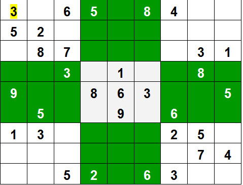

# **BACKTRACKING BASICS**

## **What is backtracking?**

Backtracking is an algorithmic technique for solving problems recursively by trying to build a solution incrementally, one piece at a time, removing those solutions that fail to satisfy the constraints of the problem at any point of time (by time, here, is referred to the time elapsed till reaching any level of the search tree).

## **Types of backtracking**

There are three types of problems in backtracking:

- Decision Problem – In this, we search for a feasible solution.
- Optimization Problem – In this, we search for the best solution.
- Enumeration Problem – In this, we find all feasible solutions.

## **When can be Backtracking Algorithm used?**

For example, consider the SudoKu solving Problem, we try filling digits one by one. Whenever we find that current digit cannot lead to a solution, we remove it (backtrack) and try next digit. This is better than naive approach (generating all possible combinations of digits and then trying every combination one by one) as it drops a set of permutations whenever it backtracks.



## **Sample problem**

Given a string, print all those permutations which do not contain `"AB"` as a substring.

### ***Naive solution***

Check all permutations of the string, if satisfied then print it out.

```cpp
#include <bits/stdc++.h>
using namespace std;

void permute(string str, int l, int r){
    if(l==r){
        if(str.find("AB")==string::npos){
            cout<<str<<" ";
        }
        return;
    }else{
        for(int i=l;i<=r;i++){
            swap(str[i],str[l]);
            permute(str,l+1,r);
            swap(str[i],str[l]);
        }   
    }
}

int main() {
	string str="ABC";
    permute(str,0,str.length()-1);      
    return 0;  
}
```

### ***Efficient solution***

```cpp
#include <bits/stdc++.h>
using namespace std;

bool isSafe(string str,int l, int i, int r){
    if(l!=0 && str[l-1]=='A' && str[i]=='B')
        return false;
    if(r==(l+1) && str[i]=='A' && str[l]=='B')
        return false;
    return true;
}

void permute(string str, int l, int r){
    if(l==r){
        cout<<str<<" ";
        return;
    }
    else{
        for(int i=l;i<=r;i++){
            if(isSafe(str,l,i,r)){
                swap(str[i],str[l]);
                permute(str,l+1,r);
                swap(str[i],str[l]);
            }
        }   
    }
}

int main() {
	string str="ABC";
    permute(str,0,str.length()-1);      
    return 0;  
	
}
```