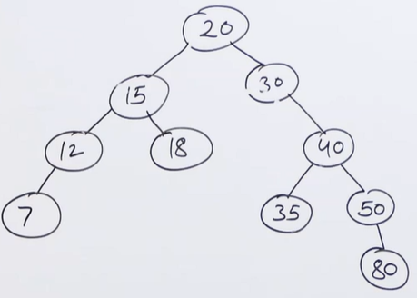
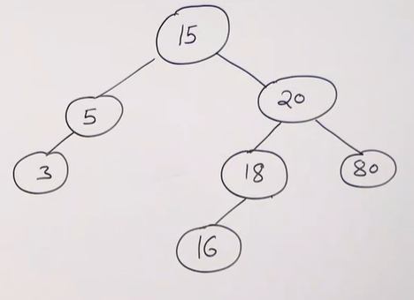
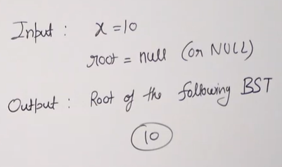
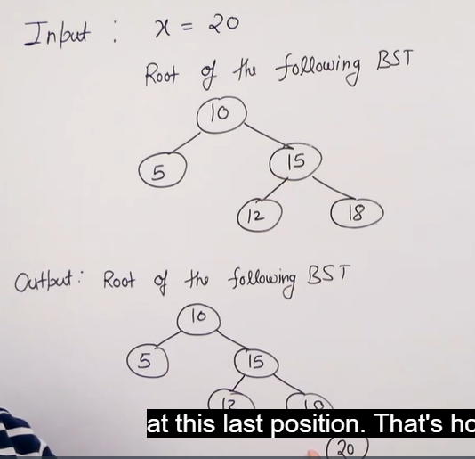
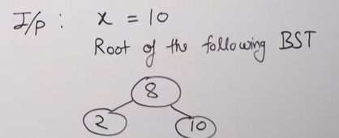
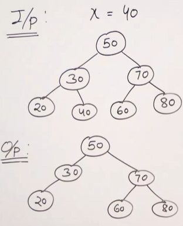
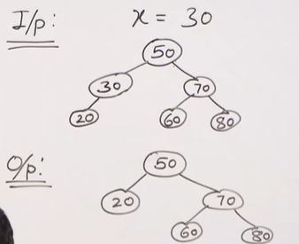
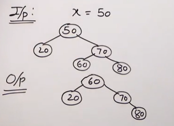

# **BINARY SEARCH TREE**

## **What is a binary search tree?**

Binary Search Tree is a node-based binary tree data structure which has the following properties:

- The left subtree of a node contains only nodes with keys lesser than or equal to the node's key.

- The right subtree of a node contains only nodes with keys greater than the node's key.

- The left and right subtree each must also be a binary search tree. There must be no duplicate nodes.

Like linked list, it is a linked data structure.

In C++, binary search tree is implemented by 

- Map

- Set

- Multimap

- Multiset

### **Example operations of BST**

1. Create an empty binary search tree = creating a binary tree.

2. Insert 20, 15, 30, 40, 50, 12, 18, 35, 80 and 7. Initially, 20 is the root. Then, 15 is smaller than 20 --> insert to the left. 30 is bigger than 20 --> insert to the right. And the insertion goes on



### **Notes**

Most of the operations on BST (search, insert, delete, finding the closest element) have time complexity of $O(h)$, where $h$ is the height of BST.

## **Search in BST**

Given a binary tree, determine if the key is present in the BST or not.



### **Algorithm for searching**

Let’s say we want to search for the number X, We start at the root. Then:

- We compare the value to be searched with the value of the root. 
    - If it’s equal we are done with the search if it’s smaller we know that we need to go to the left subtree because in a binary search tree all the elements in the left subtree are smaller and all the elements in the right subtree are larger. 
- Repeat the above step till no more traversal is possible
- If at any iteration, key is found, return True. Else False.

### **Implementation**
```cpp
#include <iostream>
using namespace std;

struct Node {
    int key;
    Node* left;
    Node* right;
    Node(int item) {
        key = item;
        left = right = NULL;
    }
};

// function to search a key in a BST
Node* search(Node* root, int key) {
  
    // Base Cases: root is null or key 
    // is present at root
    if (root == NULL || root->key == key)
        return root;

    // Key is greater than root's key
    if (root->key < key)
        return search(root->right, key);

    // Key is smaller than root's key
    return search(root->left, key);
}

// Driver Code
int main() {
  
    // Creating a hard coded tree for keeping 
    // the length of the code small. We need 
    // to make sure that BST properties are 
    // maintained if we try some other cases.
    Node* root = new Node(50);
    root->left = new Node(30);
    root->right = new Node(70);
    root->left->left = new Node(20);
    root->left->right = new Node(40);
    root->right->left = new Node(60);
    root->right->right = new Node(80);
  
    (search(root, 19) != NULL)? cout << "Found\n": 
                               cout << "Not Found\n";

  
    (search(root, 80) != NULL)? cout << "Found\n": 
                               cout << "Not Found\n";

    return 0;
}
```

## **Insertion in BST**
For example:







With this one, we will not insert anything.

### **How to insert a node in BST**

A new key is always inserted at the leaf by maintaining the property of the binary search tree. We start searching for a key from the root until we hit a leaf node. Once a leaf node is found, the new node is added as a child of the leaf node. The below steps are followed while we try to insert a node into a binary search tree:

- Check the value to be inserted (say X) with the value of the current node (say val) we are in:
    - If X is less than val move to the left subtree.
    - Otherwise, move to the right subtree.
- Once the leaf node is reached, insert X to its right or left based on the relation between X and the leaf node’s value.

### **Recursive implementation**
```cpp
#include <iostream>
using namespace std;

struct Node {
    int key;
    Node* left;
    Node* right;    
    Node(int item) {
        key = item;
        left = NULL;
        right = NULL;
    }
};

// A utility function to insert a new node with 
// the given key
Node* insert(Node* node, int key) {
  
    // If the tree is empty, return a new node
    if (node == NULL) 
        return new Node(key);    
    
    // If the key is already present in the tree,
    // return the node
    if (node->key == key) 
        return node;
    
    // Otherwise, recur down the tree/ If the key
    // to be inserted is greater than the node's key,
    // insert it in the right subtree
    if (node->key < key) 
        node->right = insert(node->right, key);
    
    // If the key to be inserted is smaller than 
    // the node's key,insert it in the left subtree
    else 
        node->left = insert(node->left, key);
    
    // Return the (unchanged) node pointer
    return node;
}

// A utility function to do inorder tree traversal
void inorder(Node* root) {
    if (root != NULL) {
        inorder(root->left);
        cout << root->key << " ";
        inorder(root->right);
    }
}

// Driver program to test the above functions
int main() {
    // Creating the following BST
    //      50
    //     /  \
    //    30   70
    //   / \   / \
    //  20 40 60 80

    Node* root = new Node(50);
    root = insert(root, 30);
    root = insert(root, 20);
    root = insert(root, 40);
    root = insert(root, 70);
    root = insert(root, 60);
    root = insert(root, 80);

    // Print inorder traversal of the BST
    inorder(root);

    return 0;
}
```

### **Iterative implementaion**
```cpp
#include <iostream>
using namespace std;

struct Node {
    int key;
    Node* left;
    Node* right;
    Node(int item)
    {
        key = item;
        left = NULL;
        right = NULL;
    }
};

Node* insert(Node* root, int x)
{

    Node* temp = new Node(x);

    // If tree is empty
    if (root == NULL)
        return temp;

    // Find the node who is going
    // to have the new node temp as
    // it child. The parent node is
    // mainly going to be a leaf node
    Node *parent = NULL, *curr = root;
    while (curr != NULL) {
        parent = curr;
        if (curr->key > x)
            curr = curr->left;
        else if (curr->key < x)
            curr = curr->right;
        else
            return root;
    }

    // If x is smaller, make it
    // left child, else right child
    if (parent->key > x)
        parent->left = temp;
    else
        parent->right = temp;
    return root;
}

// A utility function to do inorder
// tree traversal
void inorder(Node* root)
{
    if (root != NULL) {
        inorder(root->left);
        cout << root->key << " ";
        inorder(root->right);
    }
}

// Driver program
int main()
{
    // Creating the following BST
    //      50
    //     /  \
    //    30   70
    //   / \   / \
    //  20 40 60 80

    Node* root = new Node(50);
    root = insert(root, 30);
    root = insert(root, 20);
    root = insert(root, 40);
    root = insert(root, 70);
    root = insert(root, 60);
    root = insert(root, 80);

    // Print inorder traversal of the BST
    inorder(root);

    return 0;
}
```

## **Deletion in BST**

When we delete a node, three cases may arise:

***Case 1: Node to be deleted is leaf: Simply remove from the tree.***



***Case 2: Node to be deleted has only one child: Copy the child to the node and delete the child.***



***Case 3: Node to be deleted has two children: Find inorder successor of the node. Copy contents of the inorder successor to the node and delete the inorder successor. Note that inorder predecessor can also be used.***



Note: The inorder successor can be obtained by finding the minimum value in the right child of the node.

### **Implementation**

```cpp
// C++ program to demonstrate delete 
// operation in binary search tree
#include<bits/stdc++.h>
using namespace std;

// BST Node
struct node
{
    int key;
    struct node *left, *right;
};

// A utility function to create a new BST node
struct node *newNode(int item)
{
    node *temp = new node;
    temp->key = item;
    temp->left = temp->right = NULL;
    return temp;
}

// A utility function to do inorder traversal of BST
void inorder(struct node *root)
{
    if (root != NULL)
    {
        inorder(root->left);
        cout<<root->key<<" ";
        inorder(root->right);
    }
}

// A utility function to insert a new node 
// with given key in BST 
struct node* insert(struct node* node, int key)
{
    // If the tree is empty, return a new node 
    if (node == NULL) 
        return newNode(key);

    // Otherwise, recur down the tree 
    if (key < node->key)
        node->left = insert(node->left, key);
    else
        node->right = insert(node->right, key);

    // return the (unchanged) node pointer 
    return node;
}

// Function to find the minimum
// valued node in a BST
struct node * minValueNode(struct node* node)
{
    struct node* current = node;

    /* loop down to find the leftmost leaf */
    while (current->left != NULL)
        current = current->left;

    return current;
}

// Function to delete a given node from the BST
struct node* deleteNode(struct node* root, int key)
{
    // base case
    if (root == NULL) return root;

    // If the key to be deleted is smaller than the root's key,
    // then it lies in left subtree
    if (key < root->key)
        root->left = deleteNode(root->left, key);

    // If the key to be deleted is greater than the root's key,
    // then it lies in right subtree
    else if (key > root->key)
        root->right = deleteNode(root->right, key);

    // if key is same as root's key, then This is the node
    // to be deleted
    else
    {
        // node with only one child or no child
        if (root->left == NULL)
        {
            struct node *temp = root->right;
            free(root);
            return temp;
        }
        else if (root->right == NULL)
        {
            struct node *temp = root->left;
            free(root);
            return temp;
        }

        // node with two children: Get the inorder successor (smallest
        // in the right subtree)
        struct node* temp = minValueNode(root->right);

        // Copy the inorder successor's content to this node
        root->key = temp->key;

        // Delete the inorder successor
        root->right = deleteNode(root->right, temp->key);
    }
    
    return root;
}

// Driver Program to test above functions
int main()
{
    /* Let us create following BST
          50
        /     \
       30     70
      /  \   / \
     20  40 60  80 */
    struct node *root = NULL;
    root = insert(root, 50);
    root = insert(root, 30);
    root = insert(root, 20);
    root = insert(root, 40);
    root = insert(root, 70);
    root = insert(root, 60);
    root = insert(root, 80);

    cout<<"Inorder traversal of the given tree \n";
    inorder(root);

    cout<<"\nDelete 20\n";
    root = deleteNode(root, 20);
    cout<<"Inorder traversal of the modified tree \n";
    inorder(root);

    cout<<"\nDelete 30\n";
    root = deleteNode(root, 30);
    cout<<"Inorder traversal of the modified tree \n";
    inorder(root);

    cout<<"\nDelete 50\n";
    root = deleteNode(root, 50);
    cout<<"Inorder traversal of the modified tree \n";
    inorder(root);

    return 0;
}
```

## **Floor of BST**

Given a Binary Search Tree and a number $x$, find floor of $x$ in the given BST. Floor here means closest smaller or equal to $x$.
```
Input : x = 14 and root of below tree
            10
           /  \
          5    15
              /  \
            12    30
Output : 12

Input : x = 15 and root of below tree
            10
           /  \
          5    15
              /  \
            12    30
Output : 15
```

### **Algorithm**

1. Start at the `root Node`.
2. If `root->data == key`, floor of the key is equal to the root.
3. Else if `root->data > key`, then floor of the key must lie in the left subtree.
4. Else floor may lie in the right subtree but only if there is a value lesser than or equal to the key. If not, then root is the key

### **Implementation**
```cpp
// C++ code to find floor of a key in BST
#include <bits/stdc++.h>
using namespace std;

/*Structure of each Node in the tree*/
struct Node {
    int data;
    Node *left, *right;
};

/*This function is used to create and
initializes new Nodes*/
Node* newNode(int key)
{
    Node* temp = new Node;
    temp->left = temp->right = NULL;
    temp->data = key;
    return temp;
}

/* This function is used to insert
 new values in BST*/
Node* insert(Node* root, int key)
{
    if (!root)
        return newNode(key);
    if (key < root->data)
        root->left = insert(root->left, key);
    else
        root->right = insert(root->right, key);
    return root;
}

/*This function is used to find floor of a key*/
int floor(Node* root, int key)
{
    if (!root)
        return INT_MAX;

    /* If root->data is equal to key */
    if (root->data == key)
        return root->data;

    /* If root->data is greater than the key */
    if (root->data > key)
        return floor(root->left, key);

    /* Else, the floor may lie in right subtree
      or may be equal to the root*/
    int floorValue = floor(root->right, key);
    return (floorValue <= key) ? floorValue : root->data;
}

int main()
{
    /* Let us create following BST
              7
            /    \
           5      10
         /  \    /  \
        3    6   8   12 */
    Node* root = NULL;
    root = insert(root, 7);
    insert(root, 10);
    insert(root, 5);
    insert(root, 3);
    insert(root, 6);
    insert(root, 8);
    insert(root, 12);
    cout << floor(root, 9) << endl;
    return 0;
}
```

For the code above, since we use recursive function:
- Time complexity: $O(h)$
- Auxiliary space: $O(h)$

Here's the **iterative** solution

```cpp
#include <bits/stdc++.h>
using namespace std;

/* Structure of each Node in the tree */
struct Node {
    int data;
    Node *left, *right;

    Node(int key) {
        data = key;
        left = right = NULL;
    }
};

/* This function is used to find floor of 
  a key iteratively */
int findFloor(Node* root, int key) {
    int floorValue = INT_MAX;
  
    while (root) {
      
        // Root itself is floor
        if (root->data == key) {
            return root->data;
        }
      
        // If root greater, floor must
        // lie in left subtree if exists
        if (root->data > key) {
            root = root->left;
          
        // Else either root or an item
        // in the right subtree can be
        // floor  
        } else {
            floorValue = root->data;
            root = root->right;
        }
    }
    return floorValue;
}


/* This function is used to insert new 
  values in BST */
Node* insert(Node* root, int key) {
    if (!root)
        return new Node(key);
    if (key < root->data)
        root->left = insert(root->left, key);
    else
        root->right = insert(root->right, key);
    return root;
}

// Driver code
int main() {
    /* Let us create following BST
            7
           / \
          5  10
         / \ / \
        3  6 8 12 */
    Node* root = NULL;
    root = insert(root, 7);
    insert(root, 10);
    insert(root, 5);
    insert(root, 3);
    insert(root, 6);
    insert(root, 8);
    insert(root, 12);

    // Function call
    cout << findFloor(root, 9) << endl;
    return 0;
}
```

## **Ceil of BST**

```cpp
#include <bits/stdc++.h>
using namespace std;

struct Node {
    int data;
    Node *left, *right;
    Node(int value) {
        data = value;
        left = right = nullptr;
    }
};

// Helper function to find ceil of a given key in BST
int findCeil(Node* root, int key) {
  
    int ceil = -2; 

    while (root) {
      
        // If root itself is ceil
        if (root->data == key) {
            return root->data; 
        }
 
        // If root is smaller, the ceil
        // must be in the right subtree
        if (key > root->data) {
            root = root->right; 
        } 
      
        // Else either root can be ceil
        // or a node in the left child
        else {
            ceil = root->data; 
            root = root->left; 
        }
    }
    return ceil; 
}

// Driver code
int main() {
    Node* root = new Node(8);
    root->left = new Node(4);
    root->right = new Node(12);
    root->left->left = new Node(2);
    root->left->right = new Node(6);
    root->right->left = new Node(10);
    root->right->right = new Node(14);

    for (int i = 0; i < 16; i++)
        cout << findCeil(root, i) << "\n";

    return 0;
}
```

