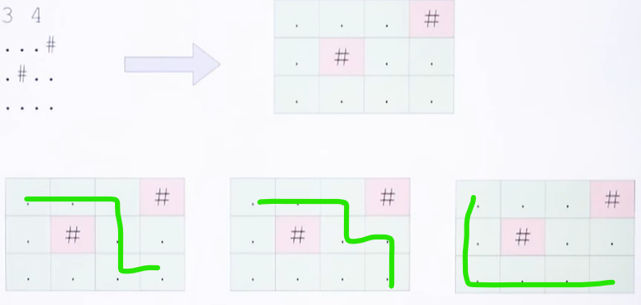

# COUNT WAYS IN GRID

The problem is to count all the possible paths from the top left to the bottom right of a $M\times N$ matrix with the constraints that from each cell you can either move only to the right or down.

### **Example**

```
Input:  M = 2, N = 2
Output: 2
Explanation: There are two paths
(0, 0) -> (0, 1) -> (1, 1)
(0, 0) -> (1, 0) -> (1, 1)

Input:  M = 2, N = 3
Output: 3
Explanation: There are three paths
(0, 0) -> (0, 1) -> (0, 2) -> (1, 2)
(0, 0) -> (0, 1) -> (1, 1) -> (1, 2)
(0, 0) -> (1, 0) -> (1, 1) -> (1, 2)
```

## RECURSION SOLUTION

To solve the problem follow the below idea:

> We can recursively move to right and down from the start until we reach the destination and then add up all valid paths to get the answer.

Follow the below steps to solve the problem:

* Create a recursive function with parameters as row and column index
* Call this recursive function for $N-1$ and $M-1$
* In the recursive function
    * If N == 1 or M == 1 then return 1
    * else call the recursive function with (N-1, M) and (N, M-1) and return the sum of this
* Print the answer

```cpp
#include <bits/stdc++.h>
using namespace std;

int numberOfPaths(int m, int n){
	if (m == 1 || n == 1)
		return 1;
	return numberOfPaths(m - 1, n) + numberOfPaths(m, n - 1);
}

int main(){
	cout << numberOfPaths(3, 3);
	return 0;
}
```

## DP SOLUTION

To solve the problem follow the below idea:

> So this problem has both properties of a dynamic programming problem. Like other typical Dynamic Programming(DP) problems, recomputations of the same subproblems can be avoided by constructing a temporary array count[][] in a bottom-up manner using the above recursive formula

Follow the below steps to solve the problem:

* Declare a 2-D array count of size $M\times N$
* Set value of $count[i][0]$ equal to 1 for $0\leq i<M$ as the answer of subproblem with a single column is equal to 1
* Set value of $count[0][j]$ equal to 1 for $0\leq j < N$ as the answer of subproblem with a single row is equal to 1
* Create a nested for loop for $0\leq i<M$ and $0\leq j < N$ and assign $count[i][j]$ equal to $count[i-1][j] + count[i][j-1]$.
* Print value of $count[M-1][N-1]$.

```cpp
#include <bits/stdc++.h>
using namespace std;

int numberOfPaths(int m, int n){
	int count[m][n];

	for (int i = 0; i < m; i++)
		count[i][0] = 1;

	for (int j = 0; j < n; j++)
		count[0][j] = 1;

	for (int i = 1; i < m; i++) {
		for (int j = 1; j < n; j++)
			count[i][j]
				= count[i - 1][j] + count[i][j - 1];
	}
	return count[m - 1][n - 1];
}

int main(){
	cout << numberOfPaths(3, 3);
	return 0;
}
```

# COUNT WAYS IN GRID WITH OBSTACLES

We are given a grid with i rows and columns. "." means a cell is free and you can travel through it and "#" means the cell is blocked and you can not travel through it. Allowed moves are down and right. Find the number of ways to reach the end cell $(N - 1, M - 1)$ starting from the cell $(0, 0)$.Print the answer modulo $10^9 + 7$.

Both cells $(0, 0)$ and $(N - 1, M - 1)$ will always be free. 

Constraints: $1 \leq N, M \leq 1000$

### **Example**



## IDEA AND SOLUTION

The only concern is that: If, currently, we are at any cell, what are the ways that we can visit a particular cell? The answer is: left adjacent and top adjacent of that cell.


- If the cell is not hash, we can visit it from its left adjacent cell or from its top adjacent cell.

- The number of ways to visit this cell is equal to the sum of number of ways that we can visit the left adjacent cell and number of ways that we can visit the top adjacent cell.

**Implementation**

- At first, $dp[1][1] = 1$

- For the next element, $dp[i][j] = dp[i - 1][j] + dp[i][j - 1]$.

- However, if $arr[i][j] = "#"$, then $dp[i][j] = 0$

- Final answer will be $dp[n][m]$