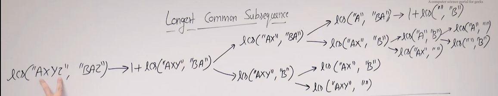

# LONGEST COMMON SUBSEQUENCE

Given two sequences, find the length of longest subsequence present in both of them. A subsequence is a sequence that appears in the same relative order, but not necessarily contiguous. For example, "abc", "abg", "bdf", "aeg", '"acefg", ... etc are subsequences of "abcdefg". 

```
INPUT: s1 = "ABCDFH", s2 = "AEDFGH"
OUTPUT: 4
Explanation: The longest subsequence is "ADFH"

INPUT: s1 = "AGGTAB", s2 = "GTXTAYB"
OUTPUT: 4
Explanation: THe longest subsequence is "GTAB"
```

## Write the recursion function of this problem

Giả sử xâu `s1 = "AXYZ"` và `s2 = "BAZ"`. Ta sẽ khởi đầu ở đuôi hai xâu. Ta thấy rằng $(s_1[m - 1] == s_2[n - 1])$, nên ta sẽ tăng kết quả lên 1 và bỏ qua cả hai ký tự cuối cùng của xâu trên.

Như vậy, bây giờ xâu `s1` và `s2` cần phải duyệt lần lượt là `"AXY"` và `"BA"`. Sau đó, ta thấy rằng hai ký tự đuôi của xâu `s1` và `s2` khác nhau, nên là ta sẽ có thể ignore ký tự cuối của 1 trong 2 xâu. Và để chắc chắn rằng ta có thể ignore xâu nào cho đúng, ta sẽ lấy 

$$max\left(lcs\left(s_1, s_2, m - 1, n\right), lcs\left(s_1, s_2, m, n - 1\right)\right)$$

Đối với base case, nếu bất kỳ xâu nào của chúng ta có độ dài bằng 0 thì lập tức trả về kết quả là 0.



### Implementation of recursive solution

```cpp
int lcs(string s1, string s2, int m, int n){
    if (m == 0 || n == 0)
        return 0;
    if (s1[m - 1] == s2[n - 1])
        return 1 + lcs(s1, s2, m - 1, n - 1);
    else
        return max(lcs(s1, s2, m - 1, n), lcs(s1, s2, m, n - 1));
}
```

## Memoization approach

- Ta sẽ cần một bảng có size $m\times n$. Đặt chúng là $memo[m + 1][n + 1]$. Ban đầu, tất cả các phần tử của bảng $memo$ đều bằng $-1$

- Nếu như $memo[m][n] != -1$ thì ta return $memo[m][n]$

- Ta thiết lập base case: nếu $m = 0$ hoặc $n = 0$ thì ta sẽ cho $memo[m][n] = 0$

- Nếu không, ta sẽ check: nếu như hai phần tử cuối cùng của xâu bằng nhau $(s_1[m - 1] == s_2[n - 1])$ thì $memo[m][n] = 1 + lcs(s_1, s_2, m - 1, n - 1)$, nếu không bằng thì $memo[m][n] = max\left(lcs\left(s_1, s_2, m - 1, n\right), lcs\left(s_1, s_2, m, n - 1\right)\right)$

- Time complexity: $O(mn)$

### Implementation

```cpp
#include <bits/stdc++.h>
using namespace std;
int memo[1000][1000];

int lcs(string s1, string s2, int m, int n){
    if (memo[m][n] != -1)
        return memo[m][n];
    if (m == 0 || n == 0)
        memo[m][n] = 0;
    else{
        if (s1[m - 1] == s2[n - 1])
            memo[m][n] = 1 + lcs(s1, s2, m - 1, n - 1);
        else
            memo[m][n] = max(lcs(s1, s2, m - 1, n), lcs(s1, s2, m, n - 1));
    }

    return memo[m][n];
}

int main(){
    string s1, s2; cin >> s1 >> s2;
    memset(memo, -1, sizeof(memo));
    cout << lcs(s1, s2, s1.size(), s2.size());
    return 0;
}
```

## Tabulation approach

- Cũng tương tự phương pháp memoization, ta sẽ tạo mảng $dp[m + 1][n + 1]$. Ban đầu, ta sẽ cho các phần tử có dạng $dp[0][i]$ và $dp[i][0]$ bằng $0$. 

- Nếu như $(s_1[i - 1] == s_2[j - 1])$ thì $dp[i][j] = 1 + dp[i - 1][j - 1]$, nếu không thì $dp[i][j] = max(dp[i - 1][j], dp[i][j - 1])$

> Ý tưởng của cả hai phương pháp trên đều như nhau, tuy nhiên đối với memoization thì ta sử dụng đệ quy để truy ngược chiều kết quả, còn đối với tabulation thì ta sẽ sử dụng vòng lặp để fill hết các giá trị trong bảng

### Implementation

```cpp
#include <bits/stdc++.h>
using namespace std;

int lcs(string s1, string s2){
    int dp[s1.length() + 1][s2.length() + 1];
    for (int i = 0; i <= s1.length(); i++)
        dp[i][0] = 0;
    for (int i = 0; i <= s2.length(); i++)
        dp[0][i] = 0;
    for (int i = 1; i <= s1.length(); i++){
        for (int j = 1; j <= s2.length(); j++){
            if (s1[i - 1] == s2[j - 1])
                dp[i][j] = 1 + dp[i - 1][j - 1];
            else
                dp[i][j] = max(dp[i][j - 1], dp[i - 1][j]);
        }
    }
    return dp[s1.length()][s2.length()];
}

int main(){
    string s1, s2; cin >> s1 >> s2;
    cout << lcs(s1, s2);
    return 0;
}
```

# VARIATIONS OF LCS

1. Diff utility

2. Minimum insertion and deletions to convert s1 into s2

3. Shorten common sequence

4. Longest palindrome sequence

5. Longest repeating subsequence

6. Space optimized DP solution of LCS

7. Printing LCS