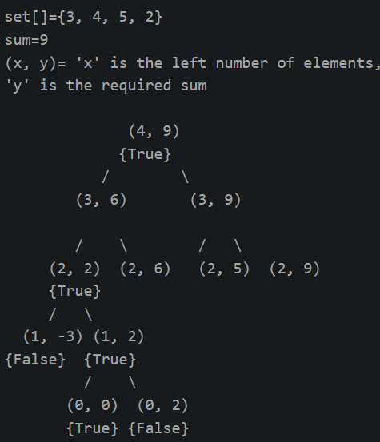
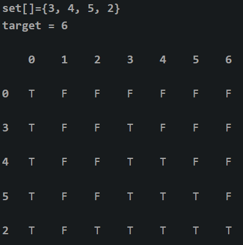

# SUBSET SUM

Given a set of non-negative integers and a value sum, determine if a subset of the given set has a sum equal to a given sum. 

Example: 
```
Input: set[] = {3, 34, 4, 12, 5, 2}, sum = 9
Output: True  
There is a subset (4, 5) with sum 9.

Input: set[] = {3, 34, 4, 12, 5, 2}, sum = 30
Output: False
There is no subset that add up to 30.
```

## Recursion:

**Approach:** For the recursive approach we will consider two cases. 

1. Consider the last element and now the `required sum = target sum – value of ‘last’ element` and `number of elements = total elements – 1`
2. Leave the ‘last’ element and now the `required sum = target sum` and `number of elements = total elements – 1`

Following is the recursive formula for `isSubsetSum()` problem. 
```
isSubsetSum(set, n, sum) 
= isSubsetSum(set, n-1, sum) || 
  isSubsetSum(set, n-1, sum-set[n-1])
Base Cases:
isSubsetSum(set, n, sum) = false, if sum > 0 and n == 0
isSubsetSum(set, n, sum) = true, if sum == 0 
```



```cpp
// A recursive solution for subset sum problem
#include <iostream>
using namespace std;

bool isSubsetSum(int set[], int n, int sum){

	if (sum == 0)
		return true;
	if (n == 0)
		return false;
  
	if (set[n - 1] > sum)
		return isSubsetSum(set, n - 1, sum);
  
	return isSubsetSum(set, n - 1, sum) || isSubsetSum(set, n - 1, sum - set[n - 1]);
}

int main(){
	int set[] = { 3, 34, 4, 12, 5, 2 };
	int sum = 9;
	int n = sizeof(set) / sizeof(set[0]);
	if (isSubsetSum(set, n, sum) == true)
		cout <<"Found a subset with given sum";
	else
		cout <<"No subset with given sum";
	return 0;
}
```

## DP

So we will create a 2D array of size `(arr.size() + 1) * (target + 1)` of type boolean. The state `DP[i][j]` will be true if there exists a subset of elements from `A[0….i]` with `sum value = ‘j’`. The approach for the problem is: 

```
if (A[i-1] > j)
	DP[i][j] = DP[i-1][j]
else 
	DP[i][j] = DP[i-1][j] OR DP[i-1][j-A[i-1]]
```

1. This means that if the current element has a value greater than the `‘current sum value’` we will copy the answer for previous cases
2. And if the current sum value is greater than the `‘ith’` element we will see if any of the previous states have already experienced the `sum=’j’` OR any previous states experienced a value `‘j – A[i]’` which will solve our purpose.

The below simulation will clarify the above approach: 



```cpp
#include <iostream>
using namespace std;

bool isSubsetSum(int set[], int n, int sum){
	bool subset[n + 1][sum + 1];

	for (int i = 0; i <= n; i++)
		subset[i][0] = true;

	for (int i = 1; i <= sum; i++)
		subset[0][i] = false;

	for (int i = 1; i <= n; i++) {
		for (int j = 1; j <= sum; j++) {
			if (j < set[i - 1])
				subset[i][j] = subset[i - 1][j];
			if (j >= set[i - 1])
				subset[i][j] = subset[i - 1][j] || subset[i - 1][j - set[i - 1]];
		}
	}

	return subset[n][sum];
}

int main(){
	int set[] = { 3, 34, 4, 12, 5, 2 };
	int sum = 9;
	int n = sizeof(set) / sizeof(set[0]);
	if (isSubsetSum(set, n, sum) == true)
		cout <<"Found a subset with given sum";
	else
		cout <<"No subset with given sum";
	return 0;
}
```