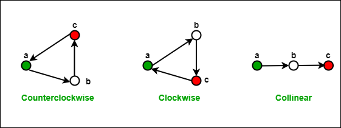
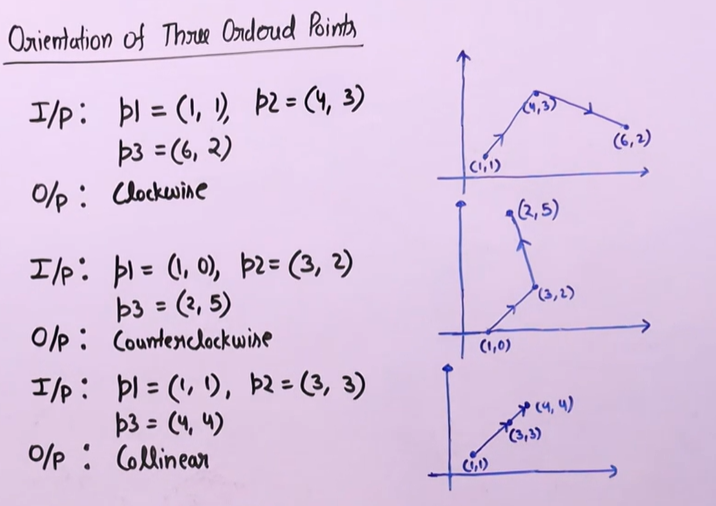

# **ORIENTATION OF THREE ORDERED POINTS**

Given three points $p_1, p_2$ and $p_3$ the task is to determine the orientation of these three points. Orientation of an ordered triplet of points in the plane can be

- counterclockwise
- clockwise
- collinear

The following diagram shows different possible orientations of $(a,b,c)$



### ***Example:***



## **Idea and solution**

### ***1. We use cross product. So what is cross product?***

Consider the cross product $v_1 \times v_2$. The orientation depends upon the sign of $\det{|v_1\times v_2|}$

We have:

$$
\det{|*v_1\times v_2|} = \begin{vmatrix} 
(x_2 - x_1) & (y_2 - y_1) \\ 
(x_3 - x_2) & (y_3 - y_2)
\end{vmatrix}
= (x_2 - x_1)(y_3 - y_2) - (x_3 - x_2)(y_2 - y_1)
$$

### ***Code***
```cpp
//C++ program to find orientation of three points
#include <iostream>
#include <bits/stdc++.h>
using namespace std;

struct Point {
	int x, y;
};

//find orientation of ordered triplet (p1, p2, p3) and function returns following values
// 0 --> collinear
// 1 --> Clockwise
// 2 --> Counterclockwise

class GFG{
public:
    int orientation(Point p1, Point p2, Point p3){
    	int val = (p2.y - p1.y) * (p3.x - p2.x) - (p2.x - p1.x) * (p3.y - p2.y);
    
    	if (val == 0)
    		return 0; // collinear
    
    	return (val > 0) ? 1 : 2; // clock or counterclock wise
    }
};

// Driver program
int main()
{
	Point p1 = { 0, 0 }, p2 = { 4, 4 }, p3 = { 1, 2 };
	class GFG obj;
	int o = obj.orientation(p1, p2, p3);

	if (o == 0)
		cout << "Linear";
	else if (o == 1)
		cout << "Clockwise";
	else
		cout << "CounterClockwise";
	cout << endl;

	p1 = { 0, 0 }, p2 = { 4, 4 }, p3 = { 1, 1 };
	o = obj.orientation(p1, p2, p3);
	if (o == 0)
		cout << "Linear";
	else if (o == 1)
		cout << "Clockwise";
	else
		cout << "CounterClockwise";
	cout << endl;

	p1 = { 1, 2 }, p2 = { 4, 4 }, p3 = { 0, 0 };
	o = obj.orientation(p1, p2, p3);
	if (o == 0)
		cout << "Linear";
	else if (o == 1)
		cout << "Clockwise";
	else
		cout << "CounterClockwise";
	return 0;
}

```