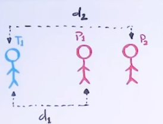
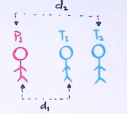

# **POLICEMAN AND THIEVES**

Given an array of size n that has the following specifications: 

1. Each element in the array contains either a policeman or a thief.
2. Each policeman can catch only one thief.
3. A policeman cannot catch a thief who is more than K units away from the policeman.

We need to find the maximum number of thieves that can be caught.

### **Example**
```
Input : arr[] = {'P', 'T', 'T', 'P', 'T'},
            k = 1.
Output : 2
Here maximum 2 thieves can be caught, first policeman catches first thief and second policeman can catch either second or third thief.

Input : arr[] = {'T', 'T', 'P', 'P', 'T', 'P'}, 
            k = 2.
Output : 3
```

## **Observations**



If $d_1 > k$, thew $d_2$ has to be greater than $k$. Hence if $P_1$ cannot catch $T_1$, thew $P_2$ and all other policemen to right of $P_1$ can vever catch $T_1$.



If $d_1 > k$, then $d_2$ has to be greater than $k$. Hence if $P_1$ cawvot catch $T_1$, Then it will not be able to catch $T_2$ and all the other thieves to the right of $T_1$.

Since each policemen can catch only 1 thief, so we try for each policemen if he can catch a thief or not.

We will start with the left most policemen and check for leftmost thief. There will be two cases
1. Leftmost thief is on the left of policemen

2. Leftmost thief is on the right of policemen

## **Implementation**

```cpp
int policeThief(char arr[], int n, int k){
	int res = 0;
	vector<int> thi;
	vector<int> pol;

	for (int i = 0; i < n; i++) {
		if (arr[i] == 'P')
			pol.push_back(i);
		else if (arr[i] == 'T')
			thi.push_back(i);
	}
	int l = 0, r = 0;
	while (l < thi.size() && r < pol.size()) {
		if (abs(thi[l] - pol[r]) <= k) {
			l++;
			r++;
			res++;
		}
		else if (thi[l] < pol[r]) {
			l++;
		}
		else {
			r++;
		}
	}
	return res;
}
```