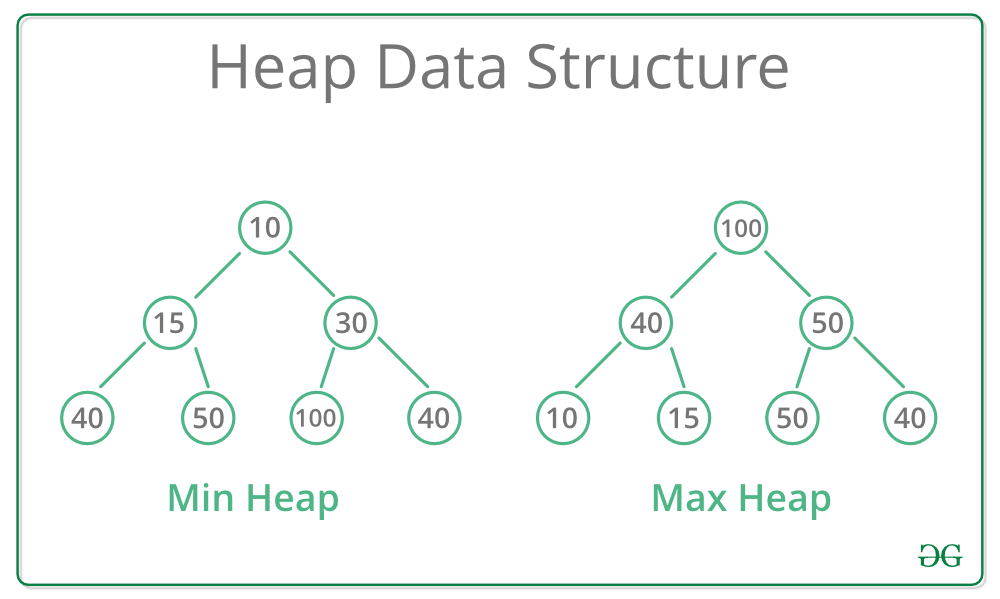

# **HEAP**

## **What is heap?**

A Heap is a Tree-based data structure, which satisfies the below properties:

1. A Heap is a complete tree (All levels are completely filled except possibly the last level and the last level has all keys as left as possible).
2. A Heap is either Min Heap or Max Heap. In a Min-Heap, the key at root must be minimum among all keys present in the Binary Heap. The same property must be recursively true for all nodes in the Tree. Max Heap is similar to MinHeap.

### **Binary heap**

A Binary Heap is a heap where each node can have at most two children. In other words, a Binary Heap is a complete Binary Tree satisfying the above-mentioned properties. 



## **Representing binary heap**

Since a Binary Heap is a complete Binary Tree, it can be easily represented using Arrays. 

- The root element will be at Arr[0].

- Below table shows indexes of other nodes for the ith node, i.e., Arr[i]:


**Getting Maximum Element:** In a Max-Heap, the maximum element is always present at the root node which is the first element in the array used to represent the Heap. So, the maximum element from a max heap can be simply obtained by returning the root node as Arr[0] in O(1) time complexity.

**Getting Minimum Element:** In a Min-Heap, the minimum element is always present at the root node which is the first element in the array used to represent the Heap. So, the minimum element from a minheap can be simply obtained by returning the root node as Arr[0] in O(1) time complexity.

## **How to implement heap? (Min heap first)**

```cpp
#include <bits/stdc++.h> 
using namespace std; 

class MinHeap{
    int *arr;
    int size;
    int capacity;
    
    public:
    
    MinHeap(int c){
    size = 0; 
    capacity = c; 
    arr = new int[c];
    }

    int left(int i) { return (2*i + 1); } 
    int right(int i) { return (2*i + 2); } 
    int parent(int i) { return (i-1)/2; } 
};

int main() 
{ 
    MinHeap h(11);
    return 0;
} 
```

# **PRIORITY QUEUE USING C++**

A **priority_queue** in C++ is always implemented using a heap data structure. In C++ this default priority queue we create is **always MAX_HEAP**. The maximum element by default is always at the top. Priority queues are a type of container adapters, specifically designed such that the first element of the queue is the greatest of all elements in the queue and elements are in non-increasing order.

**Syntax**
```cpp
priority_queue<int> pq;
```

## **Few important functions of Priority Queue:**

1. `priority_queue::push()` - The `push()` function is used to insert an element in the priority queue. The element is added to the priority queue container and the size of the queue is increased by 1. Firstly, the element is added at the back and at the same time the elements of the priority queue reorder themselves according to priority. By default, the maximum element is brought to the top.

**Syntax**
```cpp
priority_queue.push(value)
```

**Parameters:** The value of the element to be inserted is passed as the parameter. Examples:
```
Input: pqueue = {5, 2, 1}
Operation: pqueue.push(3);
Output: 5, 3, 2, 1
```

2. `priority_queue::pop()` - The `pop()` function is used to remove the top element from the priority queue. 

**Syntax:**
```cpp
priority_queue.pop()
```

**Parameters:** No parameters are passed. Examples:
```
Input: pqueue = {5, 3, 2, 1}
Operation: pqueue.pop();
Output: pqueue = {3, 2, 1}
```

3. `priority_queue::top()` - The `top()` function is used to reference the top(or the largest) element of the priority queue. 

**Syntax:**
```cpp
priority_queue.top()
```

**Parameters:** No value is needed to pass as the parameter. Return Value: Direct reference to the top(or the largest) the element of the priority queue container. Examples:
```
Input: pqueue.push(5);
       pqueue.push(1);
       pqueue.top();
Output: 5

Input: pqueue.push(5);
       pqueue.push(1);
       pqueue.push(7);
       pqueue.top();
Output: 7
```

4. `priority_queue::empty()` - The `empty()` function is used to check if the priority queue container is empty or not. 

**Syntax:**
```cpp
pqueuename.empty()
```
**Parameters:** No parameters are passed Returns: The method returns True, if priority queue is empty, else False. Examples:
```
Input :  pqueue = {3, 2, 1}
       pqueue.empty();
Output : False

Input :  pqueue
       pqueue.empty();
Output : True
```

## **How to create min heap**

Creating a priority_queue where the minimum element is always at the top (construction of a MIN_HEAP).

```cpp
priority_queue<int, vector<int>, greater<int>> pq;
```

## **Implementing priority queue with an existing vector or an array.**

```priority_queue 
pq(begin_iterator, last_iterator);
```

## **Applications**

The priority_queue can be used in various standard algorithms like:

- Dijkstra's Algorithm
- Prims Algorithm  
- Huffman Algorithm
- Heap Sort
    
Any other place where the heaps can be used.

# RELATED PROBLEMS

### [Minimize the cost](/PRIORITY%20QUEUE/minmize_cost.md)