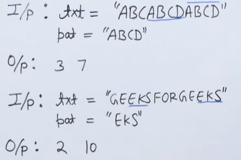

# PROBLEM STATEMENT

Given a text of length $N\space \space txt[0..N-1]$ and a pattern of length $M\space \space pat[0..M-1]$ with distinct characters, write a function `search(char pat[], char txt[])` that prints all occurrences of $pat[]$ in $txt[]$. You may assume that $N > M$.



# SOLUTION

The algorithm works as follows:

1. Calculate the lengths of the text string and the pattern string.
2. Iterate over all possible starting positions of the pattern in the text (i.e., from 0 to n-m, where n is the length of the text and m is the length of the pattern).
3. For each starting position i, compare each character of the pattern with the corresponding character of the text starting from position i. If any character does not match, break out of the loop and move to the next starting position.
4. If all characters match, then the pattern has been found at position i in the text. Print the index i and continue searching for further occurrences.
5. After the loop completes, the function returns.

```cpp
#include <bits/stdc++.h> 
using namespace std; 

void patSearchinng(string &txt,string &pat){
    int m=pat.length();
    int n=txt.length();
    for(int i=0;i<=(n-m);  ){
        int j;
        for(j=0;j<m;j++)
        if(pat[j]!=txt[i+j])
        break;
        
        if(j==m)
        cout<<i<<" ";
        if(j==0){
        i++;}
        else{
        i=(i+j);}
    }
}
 
int main() { 
    string txt = "ABCABCD";string pat="ABCD";
    cout<<"All index numbers where pattern found:"<<" ";
    patSearchinng(txt,pat);
    
    return 0; 
}
```