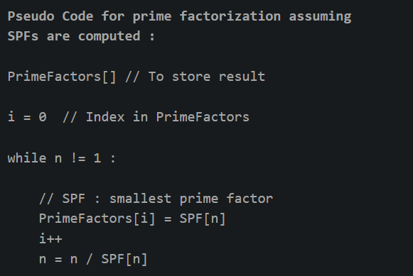

# PRIME FACTORS

Prime factor is the factor of the given number which is a prime number. Factors are the numbers you multiply together to get another number. In simple words, prime factor is finding which prime numbers multiply together to make the original number.

Example: The prime factors of 15 are 3 and 5 (because 3×5=15, and 3 and 5 are prime numbers). 

Some interesting fact about Prime Factor : 

1. There is only one (unique!) set of prime factors for any number.
2. In order to maintain this property of unique prime factorizations, it is necessary that the number one, 1, be categorized as neither prime nor composite.
3. Prime factorizations can help us with divisibility, simplifying fractions, and finding common denominators for fractions.
4. Pollard’s Rho is a prime factorization algorithm, particularly fast for a large composite number with small prime factors.
5. Cryptography is the study of secret codes. Prime Factorization is very important to people who try to make (or break) secret codes based on numbers.

## How to print a prime factor of a number?

```cpp
#include <bits/stdc++.h>
using namespace std;

void factors(int n){
    if (n <= 1)
        return;
    while (n % 2 == 0){
        cout << 2 << " "; n /= 2;
    }
    while (n % 3 == 0){
        cout << 3 << " "; n /= 3;
    }
    for (int i = 5; i * i <= n; i += 6){
        while (n % i == 0){
            cout << i << " "; n /= i;
        }
        while (n % (i + 2) == 0){
            cout << (i + 2) << " "; n /= (i + 2);
        }
    }
    if (n > 3)
        cout << n;
}

int main(){
    int n; cin >> n;
    factors(n);
    return 0;
}
```

# SMALLEST PRIME FACTORS

Given a number n, print least prime factors of all numbers from 1 to n. The least prime factor of an integer n is the smallest prime number that divides the number. The least prime factor of all even numbers is 2. A prime number is its own least prime factor (as well as its own greatest prime factor).

Note: We need to print 1 for 1.

**Example**

```
Input : 6
Output : Least Prime factor of 1: 1
         Least Prime factor of 2: 2
         Least Prime factor of 3: 3
         Least Prime factor of 4: 2
         Least Prime factor of 5: 5
         Least Prime factor of 6: 2
```

**Efficient Approach:**

1. Create a list of consecutive integers from 2 through n: (2, 3, 4, …, n).
2. Initially, let i equal 2, the smallest prime number.
3. Enumerate the multiples of i by counting to n from 2i in increments of i, and mark them as having least prime factor as i (if not already marked). Also mark i as least prime factor of i (i itself is a prime number).
4. Find the first number greater than i in the list that is not marked. If there was no such number, stop. Otherwise, let i now equal this new number (which is the next prime), and repeat from step 3.

Solution [here](/NUMBER%20THEORY/smallest_prime_factors.cpp)

Time complexity: $O(n\log{\log{n}})$

# PRIME FACTORIZATION FOR MULTIPLE QUERIES

Our idea is to store the Smallest Prime Factor(SPF) for every number. Then to calculate the prime factorization of the given number by dividing the given number repeatedly with its smallest prime factor till it becomes 1. 

To calculate to smallest prime factor for every number we will use the sieve of eratosthenes. In original Sieve, every time we mark a number as not-prime, we store the corresponding smallest prime factor for that number.

Now, after we are done with pre-calculating the smallest prime factor for every number we will divide our number n (whose prime factorization is to be calculated) by its corresponding smallest prime factor till n becomes 1. 



