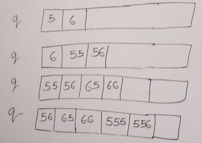

# **QUEUE**

## Generate numbers with given digit

Given a number `n`, print the first `n` numbers (in increasing order) such that all the numbers have digits in set {5; 6}

For example:
```
>>> Input: n = 10
>>> Output: 5, 6, 55, 56, 65, 66, 555, 556, 565, 566
```

```
>>> Input: n = 4
>>> Output: 5, 6, 55, 56
```

Note: `n` can be very large (long long int)

## Solutions

- Use queue

- Consider nunbers as strings as numbers might be very large

- First, enqueue 5 and 6 into the queue. 

- Run the loop, one by one pop the front element from the queue and print it.

- Append 5 and 6 to the number to the popped number.

For example:



### Implementation

```cpp
void printFirstN(int n) 
{ 
    queue<string> q;
    
    q.push("5");
    q.push("6");
    
    for(int i = 0; i < n; i++)
    {
        string curr = q.front();
       
        cout << curr << " ";
        
        q.pop();
        
        q.push(curr + "5");
        q.push(curr + "6");
    }
        
} 
```