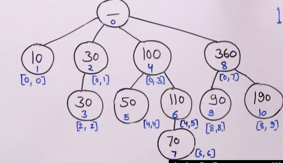

# INTRODUCTION TO BINARY INDEXED TREE (FENWICK TREE)

## **BASICS**

- Used for fixed input array and multiple queries of the following type:

    * Prefix operations (sum, product, XOR, OR, etc.)

    * Update a value

- It's actually **an array**, but the concept is ***tree-based***

- Requires $O(n\log{n})$ processing time and $\theta{(n)}$ auxiliary space.

- Another name: **FENWICK TREE**

- Can also be used for range queries.

## **PREFIX SUMS**


Let us consider the following problem to understand Binary Indexed Tree.
We have an array $arr[0\ldots n-1]$. We would like to 
1. Compute the sum of the first i elements. 
2. Modify the value of a specified element of the array arr[i] = x where $0 \leq i \leq n-1.$

A simple solution is to run a loop from $0$ to $i-1$ and calculate the sum of the elements. To update a value, simply do $arr[i] = x$. The first operation takes $O(n)$ time and the second operation takes $O(1)$ time. Another simple solution is to create an extra array and store the sum of the first i-th elements at the i-th index in this new array. The sum of a given range can now be calculated in $O(1)$ time, but the update operation takes $O(n)$ time now. This works well if there are a large number of query operations but a very few number of update operations.

One efficient solution is to use Segment Tree that performs both operations in $O(\log{n})$ time.

An alternative solution is Binary Indexed Tree, which also achieves $O(\log{n})$ time complexity for both operations. Compared with Segment Tree, Binary Indexed Tree requires less space and is easier to implement.



$$
getSum(4) = binary\_tree(3) + binary\_tree(0) = 
$$

## **HOW TO IMPLEMENT AND CONSTRUCT BINARY INDEXED TREE (FENWICK TREE)**

```cpp
// C++ code to demonstrate operations of Binary Index Tree
#include <iostream>

using namespace std;

/*         n --> No. of elements present in input array. 
    BITree[0..n] --> Array that represents Binary Indexed Tree.
    arr[0..n-1] --> Input array for which prefix sum is evaluated. */

// Returns sum of arr[0..index]. This function assumes
// that the array is preprocessed and partial sums of
// array elements are stored in BITree[].
int getSum(int BITree[], int index)
{
    int sum = 0; // Initialize result

    // index in BITree[] is 1 more than the index in arr[]
    index = index + 1;

    // Traverse ancestors of BITree[index]
    while (index>0)
    {
        // Add current element of BITree to sum
        sum += BITree[index];

        // Move index to parent node in getSum View
        index -= index & (-index);
    }
    return sum;
}

// Updates a node in Binary Index Tree (BITree) at given index
// in BITree. The given value 'val' is added to BITree[i] and 
// all of its ancestors in tree.
void updateBIT(int BITree[], int n, int index, int val)
{
    // index in BITree[] is 1 more than the index in arr[]
    index = index + 1;

    // Traverse all ancestors and add 'val'
    while (index <= n)
    {
    // Add 'val' to current node of BI Tree
    BITree[index] += val;

    // Update index to that of parent in update View
    index += index & (-index);
    }
}

// Constructs and returns a Binary Indexed Tree for given
// array of size n.
int *constructBITree(int arr[], int n)
{
    // Create and initialize BITree[] as 0
    int *BITree = new int[n+1];
    for (int i=1; i<=n; i++)
        BITree[i] = 0;

    // Store the actual values in BITree[] using update()
    for (int i=0; i<n; i++)
        updateBIT(BITree, n, i, arr[i]);

    // Uncomment below lines to see contents of BITree[]
    //for (int i=1; i<=n; i++)
    //     cout << BITree[i] << " ";

    return BITree;
}


// Driver program to test above functions
int main()
{
    int freq[] = {2, 1, 1, 3, 2, 3, 4, 5, 6, 7, 8, 9};
    int n = sizeof(freq)/sizeof(freq[0]);
    int *BITree = constructBITree(freq, n);
    cout << "Sum of elements in arr[0..5] is "
        << getSum(BITree, 5);

    // Let use test the update operation
    freq[3] += 6;
    updateBIT(BITree, n, 3, 6); //Update BIT for above change in arr[]

    cout << "\nSum of elements in arr[0..5] after update is "
        << getSum(BITree, 5);

    return 0;
}
```