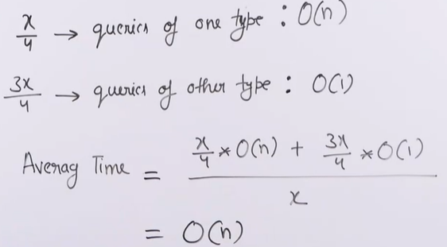
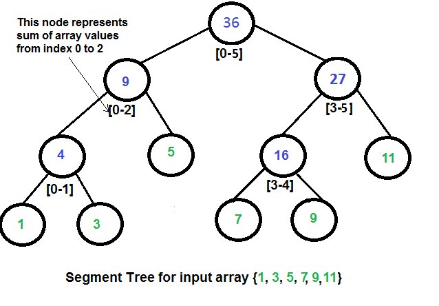

# **SEGMENT TREE**

- Used for fixed sized arrays and following two types of operations:
    * Range Query: $O(\log{n})$, typically
    * Update a value: $O(\log{n})$, typically
- Requires $O(n)$ preprocessing time and $O(n)$ auxiliary space as they are generally represented as an array.

### ***Sample problem***

Given an array `arr[]` and multiple queries:
- `getsum(a, b)`: Find the sum from index `a` to index `b`
    * `a`: Starting index
    * `b`: Ending index

- `update(a, b)`: Update the value in index `a` to `b`

For example:
```
Input: arr[] = [10, 20, 30, 40, 50]
Queries:
    getsum(0, 2)
    getsum(1, 3)
    update(1, 60)
    getsum(0, 2)
    getsum(1, 3)
Output: 60 90 100 130
```

**Method 1 (Naive solution)**

```cpp
#include <iostream>
using namespace std;

int getSum(int arr[], int qs, int qe)
{
	int sum = 0;

	for(int i = qs; i <= qe; i++)
		sum = sum + arr[i];

	return sum;
}

void update(int arr[], int i, int newVal)
{
	arr[i] = newVal;
}
	
	
int main() {
	int arr[] = {10, 20, 30, 40, 50}, n= 5;

	cout << getSum(arr, 0, 2) << " ";
	cout << getSum(arr, 1, 3) << " ";
	update(arr, 1, 60);
	cout << getSum(arr, 0, 2) << " ";
	cout << getSum(arr, 1, 3) << " ";
		
	return 0;
}
```

**Method 2: Prefix sum**

For `arr[] = [10, 20, 30, 40, 50]`
--> `prefix_sum[] = [10, 30, 60, 100, 150]`

--> `getsum(0, 2) = prefix_sum[2] = 60` 

--> `getsum(1, 3) = prefix_sum[3] - prefix_sum[0] = 100 - 10 = 90`

```cpp
#include <iostream>
using namespace std;

int getSum(int pre_sum[], int qs, int qe)
{
	if(qs == 0)
	    return pre_sum[qe];
	    
	else    
	    return pre_sum[qe] - pre_sum[qs - 1];
}

void update(int pre_sum[], int arr[], int i, int newVal, int n)
{
	int diff = newVal - arr[i];
	
	for(int j = i; j < n; j++)
	    pre_sum[j] += diff;
}

void initialize(int pre_sum[], int arr[], int n)
{
    pre_sum[0] = arr[0];
    
    for(int i = 1; i < n; i++)
    {
        pre_sum[i] = pre_sum[i - 1] + arr[i];
    }
}	
	
int main() {
	int arr[] = {10, 20, 30, 40, 50}, n= 5;
    
    int pre_sum[n];
        
    initialize(pre_sum, arr, n);
    
    
	cout << getSum(pre_sum, 0, 2) << " ";
	cout << getSum(pre_sum, 1, 3) << " ";
	
	update(pre_sum, arr, 1, 60, n);
	
	cout << getSum(pre_sum, 0, 2) << " ";
	cout << getSum(pre_sum, 1, 3) << " ";
		
	return 0;
}
```

### **MOTIVATIONS FOR USING SEGMENT TREE**



### **Segment tree solution**

What if the number of query and updates are equal? Can we perform both the operations in $O(\log{n})$ time once given the array?

We can use a segment tree to perform both of the operations in $O(\log{n})$ time complexity.

**Representation of segment tree**

1. Leaf Nodes are the elements of the input array.
2. Each internal node represents some merging of the leaf nodes. The merging may be different for different problems. For this problem, merging is the sum of leaves under a node.



**Array representation of Segment Trees:** Like Heap, segment tree is also represented as an array. The difference here is, it is not a complete binary tree. It is rather a full binary tree (every node has 0 or 2 children) and all levels are filled except possibly the last level. Unlike Heap, the last level may have gaps between nodes. Below are the values in the segment tree array for the above diagram.

**Construction of Segment Tree from the given array:** We start with a segment $arr[0 . . . n-1]$ and every time we divide the current segment into two halves(if it has not yet become a segment of length 1), and then call the same procedure on both halves, and for each such segment, we store the sum in the corresponding node.

All levels of the constructed segment tree will be completely filled except the last level. Also, the tree will be a Full Binary Tree because we always divide segments into two halves at every level. Since the constructed tree is always a full binary tree with n leaves, there will be n-1 internal nodes. So the total number of nodes will be $2n-1$. Note that this does not include dummy nodes.

**What is the total size of the array representing segment tree?**

If n is a power of 2, then there are no dummy nodes. So the size of the segment tree is $2n-1$ (n leaf nodes and $n-1$) internal nodes. If n is not a power of 2, the size of the tree will be $2x - 1$ where x is the smallest of 2 greater than n. For example, when n = 10, then size of array representing segment tree is $2 \cdot 16 - 1 = 31$

Segment tree size: 

- $n$: Size of input array

--> Segment tree size: $2\times2^{\lceil \log_2{n} \rceil} - 1$

### **Code to construct segment tree**

```cpp
#include <iostream>
using namespace std;

int CST(int ss, int se, int si, int arr[], int tree[])
{
	if(ss == se)
	{
		tree[si] = arr[ss];
		return arr[ss];
	}

	int mid = (ss + se) / 2;

	tree[si] = CST(ss, mid, 2 * si + 1, arr, tree)
		       +CST(mid + 1, se, 2 * si + 2, arr, tree);

	return tree[si];
}	
	
int main() {
	int arr[] = {10, 20, 30, 40}, n= 4;

    int tree[4 * n];
    cout << CST(0, n - 1, 0, arr, tree) << endl;
		
	return 0;
}
```