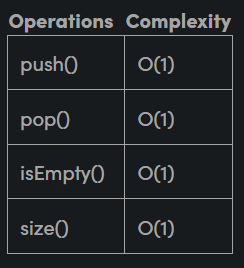
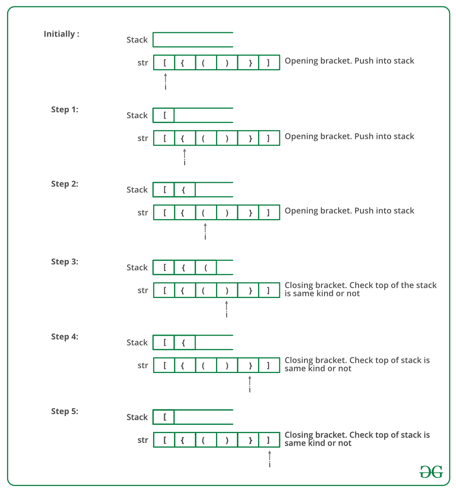
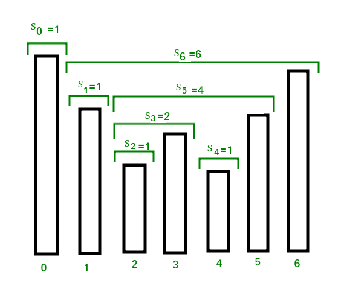

# **STACK**

## ***What is stack?***

It is a linear data structure that follows a particular order in which the operations are performed.

## ***Basic operations on stack***

- `push()` to insert an element into the stack
- `pop()` to remove an element from the stack
- `top()` Returns the top element of the stack.
- `isEmpty()` returns true if stack is empt

### *Complexity analysis*



## ***Applications of stack***

# **BALANCED PARENTHESIS**

## ***Problem statement***

Given an expression string exp, write a program to examine whether the pairs and the orders of “{“, “}”, “(“, “)”, “[“, “]” are correct in the given expression.

> **Example**

> Input: exp = “[()]{}{[()()]()}” 
>
> Output: Balanced
>
> Explanation: all the brackets are well-formed

> 
> Input: exp = “[(])” 
>
> Output: Not Balanced 
>
> Explanation: 1 and 4 brackets are not balanced because there is a closing ‘]’ before the closing ‘(‘

## ***Check for balanced bracket expression using stack***

The idea is to put all the opening brackets in the stack. Whenever you hit a closing bracket, search if the top of the stack is the opening bracket of the same nature. If this holds then pop the stack and continue the iteration, in the end if the stack is empty, it means all brackets are well-formed . Otherwise, they are not balanced.

Below is the illustration of the above approach.



Follow the steps mentioned below to implement the idea:

- Declare a character stack (say temp).
- Now traverse the string exp. 
    - If the current character is a starting bracket ( ‘(‘ or ‘{‘  or ‘[‘ ) then push it to stack.
    - If the current character is a closing bracket ( ‘)’ or ‘}’ or ‘]’ ) then pop from stack and if the popped character is the matching starting bracket then fine.
    - Else brackets are Not Balanced.
- After complete traversal, if there is some starting bracket left in stack then Not balanced, else Balanced.

## ***Implementation***
### **CPP**
```cpp
bool isBalanced(string s) {
    stack<char> st;
    for (char c : s) {
        if (c == '(' || c == '[' || c == '{') {
            st.push(c);
        } else {
            if (st.empty()) {
                return false;
            } else if (c == ')' && st.top() != '(') {
                return false;
            } else if (c == ']' && st.top() != '[') {
                return false;
            } else if (c == '}' && st.top() != '{') {
                return false;
            } else {
                st.pop();
            }
        }
    }
    return st.empty();
}
```
### **Python**
```py
def is_balanced(s):
    stack = []
    for c in s:
        if c in ['(', '[', '{']:
            stack.append(c)
        else:
            if not stack:
                return False
            current_char = stack.pop()
            if current_char == '(':
                if c != ')':
                    return False
            if current_char == '[':
                if c != ']':
                    return False
            if current_char == '{':
                if c != '}':
                    return False
    return len(stack) == 0
```

# **STOCK SPAN PROBLEM**

## ***Problem statement***

The stock span problem is a financial problem where we have a series of N daily price quotes for a stock and we need to calculate the span of the stock's price for all N days. The span Si of the stock's price on a given day i is defined as the maximum number of consecutive days just before the given day, for which the price of the stock on the current day is less than its price on the given day. 

**Example 1**

> Input: N = 7, price[] = [100 80 60 70 60 75 85]
>
> Output: 1 1 1 2 1 4 6
>
> Explanation: Traversing the given input span for 100 will be 1, 80 is smaller than 100 so the span is 1, 60 is smaller than 80 so the span is 1, 70 is greater than 60 so the span is 2 and so on. Hence the output will be 1 1 1 2 1 4 6.

**Example 2**
> Input: N = 6, price[] = [10 4 5 90 120 80]
> 
> Output:1 1 2 4 5 1
>
> Explanation: Traversing the given input span for 10 will be 1, 4 is smaller than 10 so the span will be 1, 5 is greater than 4 so the span will be 2 and so on. Hence, the output will be 1 1 2 4 5 1.



## **Naive solution**

Traverse the input price array. For every element being visited, traverse elements on the left of it and increment the span value of it while elements on the left side are smaller

```cpp
void printSpan(int arr[],int n){
    for(int i=0;i<n;i++){
        int span=1;
        for(int j=i-1;j>=0&&arr[j]<=arr[i];j--)
            span++;
        cout<<span<<" ";
    }    
}
```

### Time complexity: $O(n^2)$

## ***Efficient solution***

### **First observation**

If there is a greater element on the left side:
- Span = Index of current element - Index of closest greater element on left side 

Else:
- Span = Index of current element + 1

**Example:**

|arr[]|60|10|20|40|35|30|50|70|65|
|:---:|:---:|:---:|:---:|:---:|:---:|:---:|:---:|:---:|:---:|
|Index|0|1|2|3|4|5|6|7|8|
|Output|1|(1-0)|(2-0)|(3-0)|(4-3)|(5-4)|(6-0)|(7+1)|(8-7)

### **Implementation**

```cpp
void printSpan(int arr[],int n){
    
    stack<int> s ;
    s.push(0);
    cout<<1<<" ";
    for(int i=1;i<n;i++){
        while(s.empty()==false && arr[s.top()]<=arr[i]){
            s.pop();
        }
        int span=s.empty() ? i+1 : i-s.top();
        cout<<span<<" ";
        s.push(i);
    }
}
```

# **LARGEST RECTANGULAR AREA IN A HISTOGRAM**


# **MAXIMUM AREA RECTANGLE FULL OF 1'S**

## Problem statement

Given a binary matrix with n rows and m columns. Find the maximum sized rectangle (maximum area) that contains only 1s.

For example:

```
n = 4
m = 7
1 1 0 1 1 0 1
1 1 1 0 1 1 1
1 1 1 1 1 1 1
0 1 1 1 1 0 1
>> Output: 8
```

## Idea and solution

- Define four integers: `r1, c1, r2, c2` which stands for row one, colume one, row two, column two of the maximum sized rectangle.

- For the greatest complexity, just change `r2`

- With the lowest `r2`, for each pair of `c1, c2`, height = min(c1, c2)

### **Solution**

```cpp
#include <iostream>
#include <vector>
#include <stack>

using namespace std;

const int Nmax = 1005;

int a[Nmax][Nmax], tower[Nmax][Nmax];

long long maxRectArea(vector<int> &h) {
    int n = h.size();
    vector<int> Left(n, -1), Right(n, n);
    stack<int> st;
    for(int i = 0; i < n; i++) {
        while(!st.empty() && h[i] < h[st.top()]) {
            Right[st.top()] = i;
            st.pop();
        }
        st.push(i);
    }
    // st.clear() does not exist but we can clear it another way
    while(!st.empty()) {
        st.pop();
    }

    for(int i = n - 1; i >= 0; i--) {
        while(!st.empty() && h[i] < h[st.top()]) {
            Left[st.top()] = i;
            st.pop();
        }
        st.push(i);
    }

    long long ans = 0;
    for(int k = 0; k < n; k++) {
        ans = max(ans, 1LL * h[k] * (Right[k] - Left[k] - 1));
    }

    return ans;
}

int main() {
    int n, m;
    cin >> n >> m;
    for(int i = 1; i <= n; i++) {
        for(int j = 1; j <= m; j++) {
            cin >> a[i][j];
            if(a[i][j] == 0) {
                tower[i][j] = 0;
            }
            else {
                tower[i][j] = tower[i - 1][j] + 1;
            }
        }
    }
    long long ans = 0;
    for(int i = 1; i <= n; i++) {
        vector<int> h;
        for(int j = 1; j <= m; j++) {
            h.push_back(tower[i][j]);
        }
        ans = max(ans, maxRectArea(h));
    }
    cout << ans;
    return 0;
}
```