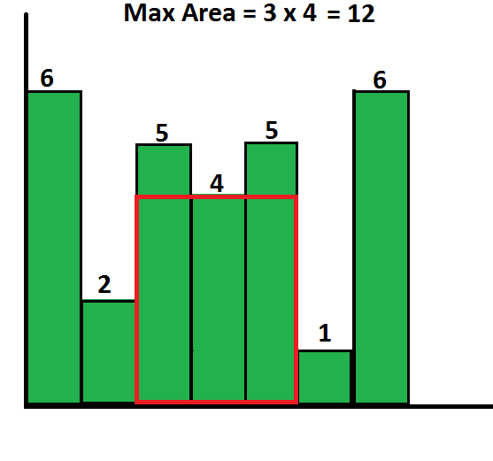
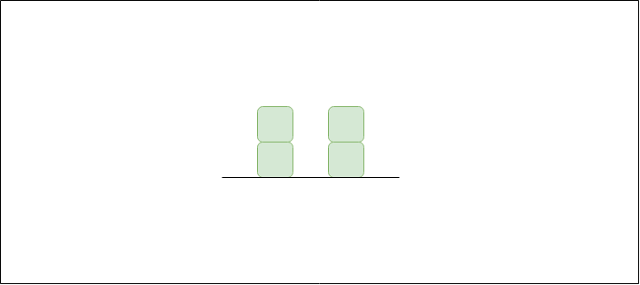
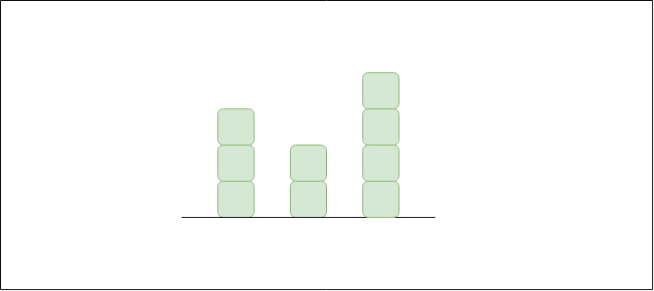

# **STACK**

## ***What is stack?***

It is a linear data structure that follows a particular order in which the operations are performed.

## ***Basic operations on stack***

- `push()` to insert an element into the stack
- `pop()` to remove an element from the stack
- `top()` Returns the top element of the stack.
- `isEmpty()` returns true if stack is empt

### *Complexity analysis*


## ***Applications of stack***

# **BALANCED PARENTHESIS**

## ***Problem statement***

Given an expression string exp, write a program to examine whether the pairs and the orders of “{“, “}”, “(“, “)”, “[“, “]” are correct in the given expression.

> **Example**

> Input: exp = “[()]{}{[()()]()}” 
>
> Output: Balanced
>
> Explanation: all the brackets are well-formed

> 
> Input: exp = “[(])” 
>
> Output: Not Balanced 
>
> Explanation: 1 and 4 brackets are not balanced because there is a closing ‘]’ before the closing ‘(‘

## ***Check for balanced bracket expression using stack***

The idea is to put all the opening brackets in the stack. Whenever you hit a closing bracket, search if the top of the stack is the opening bracket of the same nature. If this holds then pop the stack and continue the iteration, in the end if the stack is empty, it means all brackets are well-formed . Otherwise, they are not balanced.

Below is the illustration of the above approach.


Follow the steps mentioned below to implement the idea:

- Declare a character stack (say temp).
- Now traverse the string exp. 
    - If the current character is a starting bracket ( ‘(‘ or ‘{‘  or ‘[‘ ) then push it to stack.
    - If the current character is a closing bracket ( ‘)’ or ‘}’ or ‘]’ ) then pop from stack and if the popped character is the matching starting bracket then fine.
    - Else brackets are Not Balanced.
- After complete traversal, if there is some starting bracket left in stack then Not balanced, else Balanced.

## ***Implementation***
### **CPP**
```cpp
bool isBalanced(string s) {
    stack<char> st;
    for (char c : s) {
        if (c == '(' || c == '[' || c == '{') {
            st.push(c);
        } else {
            if (st.empty()) {
                return false;
            } else if (c == ')' && st.top() != '(') {
                return false;
            } else if (c == ']' && st.top() != '[') {
                return false;
            } else if (c == '}' && st.top() != '{') {
                return false;
            } else {
                st.pop();
            }
        }
    }
    return st.empty();
}
```
### **Python**
```py
def is_balanced(s):
    stack = []
    for c in s:
        if c in ['(', '[', '{']:
            stack.append(c)
        else:
            if not stack:
                return False
            current_char = stack.pop()
            if current_char == '(':
                if c != ')':
                    return False
            if current_char == '[':
                if c != ']':
                    return False
            if current_char == '{':
                if c != '}':
                    return False
    return len(stack) == 0
```

# **STOCK SPAN PROBLEM**

## ***Problem statement***

The stock span problem is a financial problem where we have a series of N daily price quotes for a stock and we need to calculate the span of the stock's price for all N days. The span Si of the stock's price on a given day i is defined as the maximum number of consecutive days just before the given day, for which the price of the stock on the current day is less than its price on the given day. 

**Example 1**

> Input: N = 7, price[] = [100 80 60 70 60 75 85]
>
> Output: 1 1 1 2 1 4 6
>
> Explanation: Traversing the given input span for 100 will be 1, 80 is smaller than 100 so the span is 1, 60 is smaller than 80 so the span is 1, 70 is greater than 60 so the span is 2 and so on. Hence the output will be 1 1 1 2 1 4 6.

**Example 2**
> Input: N = 6, price[] = [10 4 5 90 120 80]
> 
> Output:1 1 2 4 5 1
>
> Explanation: Traversing the given input span for 10 will be 1, 4 is smaller than 10 so the span will be 1, 5 is greater than 4 so the span will be 2 and so on. Hence, the output will be 1 1 2 4 5 1.


## **Naive solution**

Traverse the input price array. For every element being visited, traverse elements on the left of it and increment the span value of it while elements on the left side are smaller

```cpp
void printSpan(int arr[],int n){
    for(int i=0;i<n;i++){
        int span=1;
        for(int j=i-1;j>=0&&arr[j]<=arr[i];j--)
            span++;
        cout<<span<<" ";
    }    
}
```

### Time complexity: $O(n^2)$

## ***Efficient solution***

### **First observation**

If there is a greater element on the left side:
- Span = Index of current element - Index of closest greater element on left side 

Else:
- Span = Index of current element + 1

**Example:**

|arr[]|60|10|20|40|35|30|50|70|65|
|:---:|:---:|:---:|:---:|:---:|:---:|:---:|:---:|:---:|:---:|
|Index|0|1|2|3|4|5|6|7|8|
|Output|1|(1-0)|(2-0)|(3-0)|(4-3)|(5-4)|(6-0)|(7+1)|(8-7)

### **Implementation**

```cpp
void printSpan(int arr[],int n){
    
    stack<int> s ;
    s.push(0);
    cout<<1<<" ";
    for(int i=1;i<n;i++){
        while(s.empty()==false && arr[s.top()]<=arr[i]){
            s.pop();
        }
        int span=s.empty() ? i+1 : i-s.top();
        cout<<span<<" ";
        s.push(i);
    }
}
```

# **LARGEST RECTANGULAR AREA IN A HISTOGRAM**

## Problem statement

Find the largest rectangular area possible in a given histogram where the largest rectangle can be made of a number of contiguous bars. Each bar is of width one 

For example:

```
Input: hist = [6, 2, 5, 4, 5, 1, 6]
Output: 12
```


```
Input: hist = [2, 1, 5, 6, 2, 3]
Output: 10
```


## Idea and solution

- Create an empty stack

- Start from first bar, and do the following for every bar `hist[i]` where `i` varies from 0 to n - 1
    * If `stack.empty()` or `hist[i] > hist[stack.top()]` then push `i` to the stack
    * If this `hist[i] < hist[stack.top()]`, then keep removing the `stack.top()` while top of the stack is integer. Let the removed bar be `hist[tp]`. Calculate area of rectangle with `hist[tp]` as smallest bar. For `hist[tp]`, the left index is previous (previous to tp) item in stack and right index is `i` (current index)
- If stack is not empty, then one by one remove all bars from stack and do step 2b for every removed bar.

### CPP

```cpp
int getMaxArea(int hist[], int n){
    stack<int> s;
    int max_area = 0, tp, area_with_top;
    int i = 0;
    while (i < n){
        if (s.empty() || hist[s.top()] <= hist[i])
            s.push(i++);
        else{
            tp = s.top()
            s.pop();
            area_with_top = hist[tp] * (s.empty() ? i : i - s.top() - 1);
            max_area = max(max_area, area_with_top);
        }
    }
    while (!s.empty()){
        tp = s.top(); s.pop();
        area_with_top = hist[tp] * (s.empty() ? i : i - s.top() - 1);
        max_area = max(max_area, area_with_top);
    }
    return max_area;
}
```

### Python

```py
def largest_rectangle_area(heights):
    maxArea = 0
    stack = [] # Pair: (index, height)

    for i, h in enumerate(heights):
        start = i
        while stack and stack[-1][1] > h:
            index, height = stack.pop()
            maxArea = max(maxArea, height * (i - index))
            start = index
        stack.append((start, h))

    for i, h in stack:
        maxArea = max(maxArea, h * (len(heights) - i))
    return maxArea
```

# **MAXIMUM AREA RECTANGLE FULL OF 1'S**

## Problem statement

Given a binary matrix with n rows and m columns. Find the maximum sized rectangle (maximum area) that contains only 1s.

For example:

```
n = 4
m = 7
1 1 0 1 1 0 1
1 1 1 0 1 1 1
1 1 1 1 1 1 1
0 1 1 1 1 0 1
>> Output: 8
```

## Idea and solution

- Define four integers: `r1, c1, r2, c2` which stands for row one, colume one, row two, column two of the maximum sized rectangle.

- For the greatest complexity, just change `r2`

- With the lowest `r2`, for each pair of `c1, c2`, height = min(c1, c2)

### **Solution**

```cpp
#include <iostream>
#include <vector>
#include <stack>

using namespace std;

const int Nmax = 1005;

int a[Nmax][Nmax], tower[Nmax][Nmax];

long long maxRectArea(vector<int> &h) {
    int n = h.size();
    vector<int> Left(n, -1), Right(n, n);
    stack<int> st;
    for(int i = 0; i < n; i++) {
        while(!st.empty() && h[i] < h[st.top()]) {
            Right[st.top()] = i;
            st.pop();
        }
        st.push(i);
    }
    // st.clear() does not exist but we can clear it another way
    while(!st.empty()) {
        st.pop();
    }

    for(int i = n - 1; i >= 0; i--) {
        while(!st.empty() && h[i] < h[st.top()]) {
            Left[st.top()] = i;
            st.pop();
        }
        st.push(i);
    }

    long long ans = 0;
    for(int k = 0; k < n; k++) {
        ans = max(ans, 1LL * h[k] * (Right[k] - Left[k] - 1));
    }

    return ans;
}

int main() {
    int n, m;
    cin >> n >> m;
    for(int i = 1; i <= n; i++) {
        for(int j = 1; j <= m; j++) {
            cin >> a[i][j];
            if(a[i][j] == 0) {
                tower[i][j] = 0;
            }
            else {
                tower[i][j] = tower[i - 1][j] + 1;
            }
        }
    }
    long long ans = 0;
    for(int i = 1; i <= n; i++) {
        vector<int> h;
        for(int j = 1; j <= m; j++) {
            h.push_back(tower[i][j]);
        }
        ans = max(ans, maxRectArea(h));
    }
    cout << ans;
    return 0;
}
```

# **TRAP WATER RAINFALL**

Given an array of N non-negative integers arr[] representing an elevation map where the width of each bar is 1, compute how much water it is able to trap after raining.

### **Example:**
```
Input: arr = [2, 0, 2]
Output: 2
Explanation: The structure is like below.
We can trap 2 units of water in the middle gap.
```


```
Input: arr[]   = {3, 0, 2, 0, 4}
Output: 7
Explanation: Structure is like below.
We can trap "3 units" of water between 3 and 2,
"1 unit" on top of bar 2 and "3 units" between 2 and 4.
```


## **Idea and solution**
We can use a stack to track the bars that are bounded by the longer left and right bar. This can be done using only one interation using STACK.

Approach:
1. Loop through the indices of the bar array

2. For each bar:

- While the stack is not empty and the current bar has a height greater than the top bar of the stack

- Store the index of the top bar in `pop_height` and pop it from the stack

- Find the distance between the left bar (current top) of the top bar and the current bar

- Find the minimum height between the top bar and the current bar.

- The maximum water that can be trapped in `distance`

- `Water trapped = distance * (min(hl, hr) - pop_height)`

- Add that to the `fans`

- Push `i` to the stack.

3. Final answer will be `fans`

## **Illustration**

Consider the array arr[] = {3, 0, 2, 0, 4} and an empty stack st.

For i = 0:

=> The stack is empty. So no elements with higher value on left.

=> Push the index into the stack. st = {0} [to keep track of the distance in between]

For i = 1:

=> arr[1] is less than arr[stack top]. So arr[1] has a higher left bound.

=> Push the index into stack. st = {0, 1}

For i = 2:

=> arr[2] is greater than arr[stack top]. So arr[2] is the higher right bound of current stack top.

=> Calculate the water stored in between the left and right bound of the stack top. 

=> The stack top is the base height in between the left and right bound.
        
=> Pop the stack top. So st = {0}.

=> Water stored in between when arr[0] and arr[2] are the bound= {min(arr[0], arr[2]) - arr[1]} * (2 - 0 - 1) = 2.

=> arr[0] is greater than arr[2] Push the index into stack. st = {0, 2}.

=> Total water stored = 0 + 2 = 2.

For i = 3:

=> arr[3] is less than arr[2]. So arr[3] has a higher left bound.

=> Push the index into the stack. st = {0, 2, 3}.

For i = 4:
        
=> arr[4] is greater than arr[stack top]. So arr[4] is the higher right bound of current stack top.

=> Calculate the water stored in same way as for i = 2. The base height is arr[3].

=> Pop the stack top. So st = {0, 2}.

=> Water stored in between when arr[4] and arr[2] are the bound= {min(arr[4], arr[2]) - arr[3]} * (4 - 2 - 1) = 2.

=> arr[4] is greater than arr[2].

=> Pop the stack. st = {0}.

=> Water stored in between arr[0] and arr[4] when arr[2] is the base height = {min(3, 4) - 2} * (4 - 0 - 1) = 3

=> arr[0] less than arr[4]. So pop stack. st = {}.

=> As no element left in the stack push the index. st = {4}.

=> Total water stored = 2 + 2 + 3 = 7.

So the total amount of water stored  = 7.

## **Implementation**

```cpp
// C++ implementation of the approach
#include <bits/stdc++.h>
using namespace std;

// Function to return the maximum
// water that can be stored
int maxWater(int height[], int n)
{

    // Stores the indices of the bars
    stack<int> st;

    // Stores the final result
    int ans = 0;

    // Loop through the each bar
    for (int i = 0; i < n; i++) {

        // Remove bars from the stack
        // until the condition holds
        while ((!st.empty())
               && (height[st.top()] < height[i])) {

            // Store the height of the top
            // and pop it.
            int pop_height = height[st.top()];
            st.pop();

            // If the stack does not have any
            // bars or the popped bar
            // has no left boundary
            if (st.empty())
                break;

            // Get the distance between the
            // left and right boundary of
            // popped bar
            int distance = i - st.top() - 1;

            // Calculate the min. height
            int min_height
                = min(height[st.top()], height[i])
                  - pop_height;

            ans += distance * min_height;
        }

        // If the stack is either empty or
        // height of the current bar is less than
        // or equal to the top bar of stack
        st.push(i);
    }
    return ans;
}

// Driver code
int main()
{

    int arr[] = { 0, 1, 0, 2, 1, 0, 1, 3, 2, 1, 2, 1 };
    int n = sizeof(arr) / sizeof(arr[0]);

    cout << maxWater(arr, n);

    return 0;
}
```