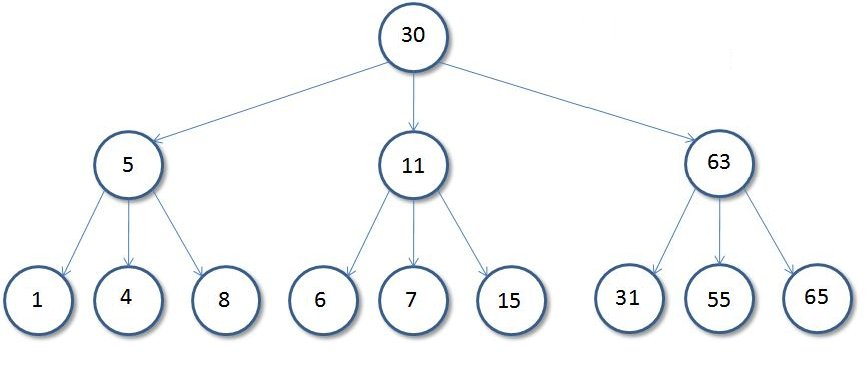
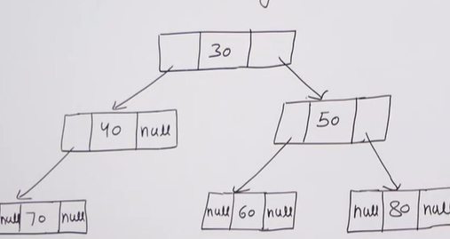
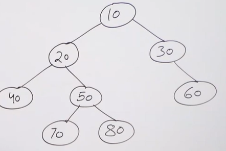
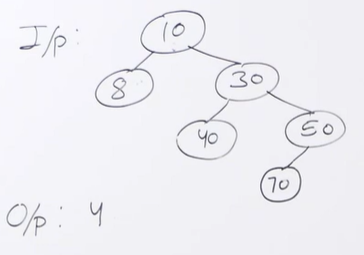
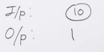

# **TREE**

A tree is a ***non-linear*** data structure where each node is connected to a ***number of nodes*** with the help of pointers or references.

## Basic tree terminologies


- **Root:** The root of a tree is the first node of the tree. In the above image, the root node is the node 30.
- Edge: An edge is a link connecting any two nodes in the tree. For example, in the above image there is an edge between node 11 and 6.
- Siblings: The children nodes of same parent are called siblings. That is, the nodes with same parent are called siblings. In the above tree, nodes 5, 11, and 63 are siblings.
- Leaf Node: A node is said to be the leaf node if it has no children. In the above tree, node 15 is one of the leaf nodes.
- Height of a Tree: Height of a tree is defined as the total number of levels in the tree or the length of the path from the root node to the node present at the last level. The above tree is of height 2.
- Degree of a node: The number of children it has. For instance, degree of 11 equals 3 (as it has three children 6, 7, 15)

## ***Binary tree***


A tree which nodes have at most 2 children (nodes have a degree at most 2).

### **Representation**



- Every node has three fields:
    * Left pointer (C/C++) or left reference (Python/Java)
    * Data field
    * Right pointer (C/C++) or right reference (Python/Java)

- Here's how to represent it in C++
```cpp
struct Node  
{ 
  int key; 
  struct Node *left; 
  struct Node *right; 
  Node(int k){
      key=k;
      left=right=NULL;
  }
};
    
int main() {
	
	Node *root=new Node(10);
	root->left=new Node(20);
	root->right=new Node(30);
	root->left->left=new Node(40);
}
```

- If you want to create an empty tree at first, we can type
```cpp
Node *root = NULL;
```
### ***Properties of a binary tree***

1. The maximum number of nodes at level $l$ of a binary tree is $2^{l - 1}$.

2. Maximum number of nodes in a binary tree of height $h$ is $2^{h} - 1$: Here height of a tree is the maximum number of nodes on the root to leaf path. The height of a tree with a single node is considered as 1. This result can be derived from point 2 above. A tree has maximum nodes if all levels have maximum nodes. So maximum number of nodes in a binary tree of height $h$ is $1 + 2 + 4 + \ldots + 2^h - 1$. his is a simple geometric series with $h$ terms and sum of this series is $2^h - 1$.

3. In a Binary Tree with $N$ nodes, the minimum possible height or the minimum number of levels is $\log_2{(N + 1)}$: This can be directly derived from point 2 above. If we consider the convention where the height of a leaf node is considered 0, then above formula for minimum possible height becomes $\log_2{(N + 1)} - 1$

4. A Binary Tree with $L$ leaves has at least $\log_2{L} + 1$ levels: A  Binary tree has maximum number of leaves (and minimum number of levels) when all levels are fully filled. Let all leaves be at level $l$, then below is true for number of leaves $L$

```
   L   <=  2l-1  [From Point 1]
   l =  Log2L + 1 
   where l is the minimum number of levels. 
```

5. In a Binary tree in which every node has 0 or 2 children, the number of leaf nodes is always one more than the nodes with two children.

### ***Tree traversals***

> **Breadth First Search (BFS)** 

> **Depth First Search (DFS)**

Main idea (using recursion):
- Traverse root
- Traverse left subtree just like traversing root
- Traverse right subtree just like traversing root

Take a loot at this example:



1. ***In-order DFS***

- Order: Left --> Root --> Right. Thus, output looks like this: 40 20 70 50 80 10 30 60

2. ***Pre-order DFS***

- Order: Root --> Left --> Right. Thus, output looks like this: 10 20 40 50 70 80 30 60

3. ***Post-order DFS***

- Order: Left --> Right --> Root. Thus, output looks like this: 40 70 80 50 20 60 30 10

### ***Height of a binary tree:***





**Idea**
- Take the height of the left subtree recursively, then take the height of the right subtree recursively, then find the greater between the two and add 1 (representing the root of the tree).

**Implementation**
```cpp
#include <bits/stdc++.h>
using namespace std;

struct Node  
{ 
  int key; 
  struct Node *left; 
  struct Node *right; 
  Node(int k){
      key=k;
      left=right=NULL;
  }
};

int height(Node *root){
    if(root==NULL)
        return 0;
    else
        return (1+max(height(root->left),height(root->right)));
}  

int main() {
	
	Node *root=new Node(10);
	root->left=new Node(20);
	root->right=new Node(30);
	root->right->left=new Node(40);
	root->right->right=new Node(50);
	
	cout<<height(root);
}
```

### ***Size of a binary tree***

```cpp
#include <bits/stdc++.h>
using namespace std;

struct Node  
{ 
  int key; 
  struct Node *left; 
  struct Node *right; 
  Node(int k){
      key=k;
      left=right=NULL;
  }
};

int getSize(Node *root){
    if(root==NULL)
        return 0;
    else
        return 1+getSize(root->left)+getSize(root->right);
} 

int main() {
	
	Node *root=new Node(10);
	root->left=new Node(20);
	root->right=new Node(30);
	root->left->left=new Node(40);
	root->left->right=new Node(50);
	root->right->right=new Node(60);
	
	cout<<getSize(root);
}
```