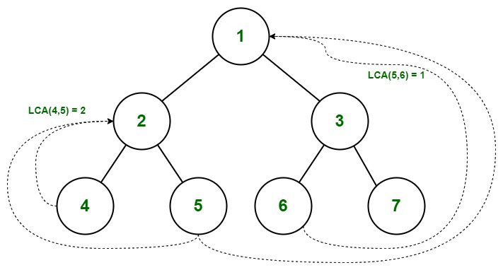
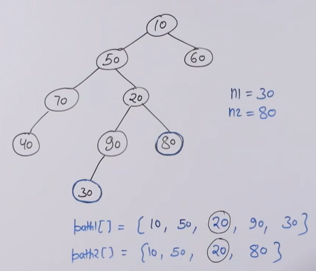

# **TREE**

A tree is a ***non-linear*** data structure where each node is connected to a ***number of nodes*** with the help of pointers or references.

## Basic tree terminologies


- **Root:** The root of a tree is the first node of the tree. In the above image, the root node is the node 30.
- Edge: An edge is a link connecting any two nodes in the tree. For example, in the above image there is an edge between node 11 and 6.
- Siblings: The children nodes of same parent are called siblings. That is, the nodes with same parent are called siblings. In the above tree, nodes 5, 11, and 63 are siblings.
- Leaf Node: A node is said to be the leaf node if it has no children. In the above tree, node 15 is one of the leaf nodes.
- Height of a Tree: Height of a tree is defined as the total number of levels in the tree or the length of the path from the root node to the node present at the last level. The above tree is of height 2.
- Degree of a node: The number of children it has. For instance, degree of 11 equals 3 (as it has three children 6, 7, 15)

## ***Binary tree***


A tree which nodes have at most 2 children (nodes have a degree at most 2).

### **Representation**


- Every node has three fields:
    * Left pointer (C/C++) or left reference (Python/Java)
    * Data field
    * Right pointer (C/C++) or right reference (Python/Java)

- Here's how to represent it in C++
```cpp
struct Node  
{ 
  int key; 
  struct Node *left; 
  struct Node *right; 
  Node(int k){
      key=k;
      left=right=NULL;
  }
};
    
int main() {
	
	Node *root=new Node(10);
	root->left=new Node(20);
	root->right=new Node(30);
	root->left->left=new Node(40);
}
```

- If you want to create an empty tree at first, we can type
```cpp
Node *root = NULL;
```
### ***Properties of a binary tree***

1. The maximum number of nodes at level $l$ of a binary tree is $2^{l - 1}$.

2. Maximum number of nodes in a binary tree of height $h$ is $2^{h} - 1$: Here height of a tree is the maximum number of nodes on the root to leaf path. The height of a tree with a single node is considered as 1. This result can be derived from point 2 above. A tree has maximum nodes if all levels have maximum nodes. So maximum number of nodes in a binary tree of height $h$ is $1 + 2 + 4 + \ldots + 2^h - 1$. his is a simple geometric series with $h$ terms and sum of this series is $2^h - 1$.

3. In a Binary Tree with $N$ nodes, the minimum possible height or the minimum number of levels is $\log_2{(N + 1)}$: This can be directly derived from point 2 above. If we consider the convention where the height of a leaf node is considered 0, then above formula for minimum possible height becomes $\log_2{(N + 1)} - 1$

4. A Binary Tree with $L$ leaves has at least $\log_2{L} + 1$ levels: A  Binary tree has maximum number of leaves (and minimum number of levels) when all levels are fully filled. Let all leaves be at level $l$, then below is true for number of leaves $L$

```
   L   <=  2l-1  [From Point 1]
   l =  Log2L + 1 
   where l is the minimum number of levels. 
```

5. In a Binary tree in which every node has 0 or 2 children, the number of leaf nodes is always one more than the nodes with two children.

### ***Tree traversals***

> **Breadth First Search (BFS)** 

Level order traversal is another type of traversal in a binary tree. In level order traversal, we visit all nodes at the same level before moving on to the next level. This traversal starts at the root node and visits its left and right children, then visits the left and right children of the first level nodes, and so on. We can use a queue data structure to implement level order traversal.

Level order traversal is also known as breadth-first traversal because we visit nodes breadth-wise from left to right across each level of the tree.

**Implementation**
```cpp
#include <bits/stdc++.h>
using namespace std;

struct Node  
{ 
  int key; 
  struct Node *left; 
  struct Node *right; 
  Node(int k){
      key=k;
      left=right=NULL;
  }
};

void printLevel(Node *root){
    if(root==NULL)return;
    queue<Node *>q;
    q.push(root);
    while(q.empty()==false){
        Node *curr=q.front();
        q.pop();
        cout<<curr->key<<" ";
        if(curr->left!=NULL)
            q.push(curr->left);
        if(curr->right!=NULL)
            q.push(curr->right);
    }
}  

int main() {
	
	Node *root=new Node(10);
	root->left=new Node(20);
	root->right=new Node(30);
	root->left->left=new Node(40);
	root->left->right=new Node(50);
	root->right->left=new Node(60);
	root->right->right=new Node(70);
	
	printLevel(root);
}
```

**BFS Line by Line**

For each node, first, the node is visited and then it’s child nodes are put in a FIFO queue. Then again the first node is popped out and then it’s child nodes are put in a FIFO queue and repeat until queue becomes empty.

Follow the below steps to Implement the above idea:

- Create an empty queue q and push root in q.
- Run a While loop until q is not empty. 
    * Initialize temp_node = q.front() and print temp_node->data.
    * Push temp_node’s children i.e. temp_node -> left then temp_node -> right to q
    * Pop front node from q.

```cpp
void levelOrderTraversal(Node* root) {
    if (root == NULL) {
        return;
    }
    queue<Node*> q;
    q.push(root);
    while (!q.empty()) {
        Node* node = q.front();
        q.pop();
        cout << node->data << " ";
        if (node->left) {
            q.push(node->left);
        }
        if (node->right) {
            q.push(node->right);
        }
    }
}

Node* createNode(int data) {
    Node* newNode = new Node();
    newNode->data = data;
    newNode->left = newNode->right = NULL;
    return newNode;
}
```

Another method:
Here's the step-by-step approach of the level order traversal implemented in the given code:

- First, we create a printLevel function that takes the root node of the binary tree as its argument.
- Inside the printLevel function, we initialize a queue named q of type Node*. We push the root node into this queue using the push() method.
- Next, we start a while loop that will continue until the queue becomes empty.
- Inside the while loop, we use a for loop to iterate over all the nodes present at the current level of the binary tree. The count variable keeps track of the number of nodes present at the current level.
- In each iteration of the for loop, we dequeue the first node from the queue and assign it to a temporary pointer variable curr.
- We print the value of the key of the current node.
- Next, we check if the left child of the current node exists or not. If it exists, we push it into the queue using the push() method.
- Similarly, we check if the right child of the current node exists or not, and if it does, we push it into the queue using the push() method.
- After processing all the nodes at the current level, we print a new line character \n to move to the next level of the binary tree.
- The while loop continues until the queue becomes empty, which means we have traversed all the nodes of the binary tree.
- Finally, we create a main() function in which we create a binary tree by adding nodes and pass the root node of this binary tree to the printLevel function to perform level order traversal.

```cpp
#include <bits/stdc++.h>
using namespace std;

struct Node  { 
  int key; 
  struct Node *left; 
  struct Node *right; 
  Node(int k){
      key=k;
      left=right=NULL;
  }
};

void printLevel(Node *root){
    if(root==NULL)return;
    queue<Node *>q;
    q.push(root);
    while(q.empty()==false){
        int count=q.size();
        for(int i=0;i<count;i++){
        Node *curr=q.front();
        q.pop();
        cout<<curr->key<<" ";
        if(curr->left!=NULL)
            q.push(curr->left);
        if(curr->right!=NULL)
            q.push(curr->right);
        }
        cout<<"\n";
    }
}  

int main() {
	
	Node *root=new Node(10);
	root->left=new Node(20);
	root->right=new Node(30);
	root->left->left=new Node(40);
	root->left->right=new Node(50);
	root->right->left=new Node(60);
	root->right->right=new Node(70);
	
	printLevel(root);
}
```
> **Depth First Search (DFS)**

Main idea (using recursion):
- Traverse root
- Traverse left subtree just like traversing root
- Traverse right subtree just like traversing root

Take a loot at this example:


1. ***In-order DFS***

- Order: Left --> Root --> Right. Thus, output looks like this: 40 20 70 50 80 10 30 60

2. ***Pre-order DFS***

- Order: Root --> Left --> Right. Thus, output looks like this: 10 20 40 50 70 80 30 60

3. ***Post-order DFS***

- Order: Left --> Right --> Root. Thus, output looks like this: 40 70 80 50 20 60 30 10

### ***Height of a binary tree:***


**Idea**
- Take the height of the left subtree recursively, then take the height of the right subtree recursively, then find the greater between the two and add 1 (representing the root of the tree).

**Implementation**
```cpp
#include <bits/stdc++.h>
using namespace std;

struct Node  
{ 
  int key; 
  struct Node *left; 
  struct Node *right; 
  Node(int k){
      key=k;
      left=right=NULL;
  }
};

int height(Node *root){
    if(root==NULL)
        return 0;
    else
        return (1+max(height(root->left),height(root->right)));
}  

int main() {
	
	Node *root=new Node(10);
	root->left=new Node(20);
	root->right=new Node(30);
	root->right->left=new Node(40);
	root->right->right=new Node(50);
	
	cout<<height(root);
}
```

### ***Size of a binary tree***

```cpp
#include <bits/stdc++.h>
using namespace std;

struct Node  
{ 
  int key; 
  struct Node *left; 
  struct Node *right; 
  Node(int k){
      key=k;
      left=right=NULL;
  }
};

int getSize(Node *root){
    if(root==NULL)
        return 0;
    else
        return 1+getSize(root->left)+getSize(root->right);
} 

int main() {
	
	Node *root=new Node(10);
	root->left=new Node(20);
	root->right=new Node(30);
	root->left->left=new Node(40);
	root->left->right=new Node(50);
	root->right->right=new Node(60);
	
	cout<<getSize(root);
}
```

## ***LCA of Binary tree***

The lowest common ancestor is the lowest node in the tree that has both $n_1$ and $n_2$ as descendants, where $n_1$ and $n_2$ are the nodes for which we wish to find the LCA. Hence, the LCA of a binary tree with nodes $n_1$ and $n_2$ is the shared ancestor of $n_1$ and $n_2$ that is located farthest from the root. 



### **Naive solution**

- Create two arrays that stores the path from the root to $n_1$ and $n_2$. For example:



- Traverse both paths till the values in arrays are the same. Return the common element just before the mismatch.

```cpp
#include <bits/stdc++.h>
using namespace std;
 
struct Node {
    int key;
    struct Node *left, *right;
};
 
Node* newNode(int k){
    Node* temp = new Node;
    temp->key = k;
    temp->left = temp->right = NULL;
    return temp;
}
 
bool findPath(Node* root, vector<int>& path, int k){
    if (root == NULL)
        return false;
 
    path.push_back(root->key);
 
    if (root->key == k)
        return true;
 
    if ((root->left && findPath(root->left, path, k))
        || (root->right && findPath(root->right, path, k)))
        return true;
 
    path.pop_back();
    return false;
}
int findLCA(Node* root, int n1, int n2){
    vector<int> path1, path2;
 
    if (!findPath(root, path1, n1)
        || !findPath(root, path2, n2))
        return -1;

    int i;
    for (i = 0; i < path1.size() && i < path2.size(); i++)
        if (path1[i] != path2[i])
            break;
    return path1[i - 1];
}
 
int main(){
    Node* root = newNode(1);
    root->left = newNode(2);
    root->right = newNode(3);
    root->left->left = newNode(4);
    root->left->right = newNode(5);
    root->right->left = newNode(6);
    root->right->right = newNode(7);
    cout << "LCA(4, 5) = " << findLCA(root, 4, 5);
    cout << "\nLCA(4, 6) = " << findLCA(root, 4, 6);
    cout << "\nLCA(3, 4) = " << findLCA(root, 3, 4);
    cout << "\nLCA(2, 4) = " << findLCA(root, 2, 4);
    return 0;
}
```

