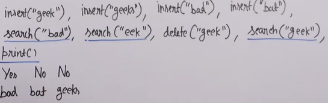
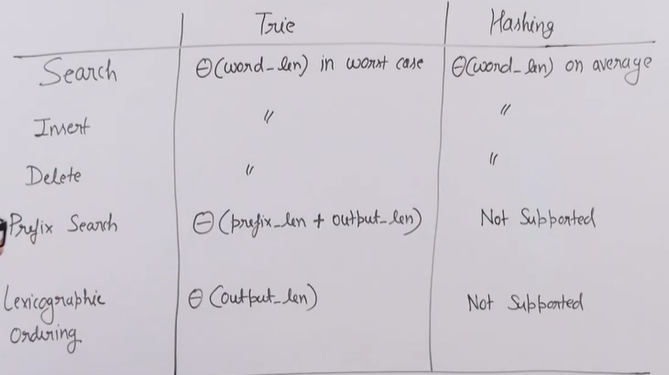

# TRIE

## INTRODUCTION

Efficient for the following operations on words in a dictionary:

- Search
- Insert
- Delete
- Prefix search: finding all the words beginning with a particular prefix.
- Lexicographical ordering of words

### Comparison with hashing

