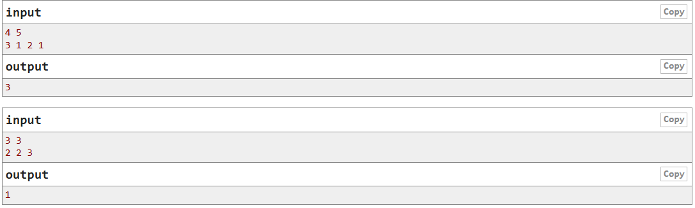

# **BOOKS**

When Valera has got some free time, he goes to the library to read some books. Today he's got $t$ free minutes to read. That's why Valera took n books in the library and for each book he estimated the time he is going to need to read it. Let's number the books by integers from 1 to $n$. Valera needs $a_i$ minutes to read the $i$-th book.

Valera decided to choose an arbitrary book with number $i$ and read the books one by one, starting from this book. In other words, he will first read book number $i$, then book number $i + 1$, then book number $i + 2$ and so on. He continues the process until he either runs out of the free time or finishes reading the $n$-th book. Valera reads each book up to the end, that is, he doesn't start reading the book if he doesn't have enough free time to finish reading it.

Print the maximum number of books Valera can read.

### **Input**

The first line contains two integers $n$ and $t (1\leq n\leq 10^5; 1\leq t\leq 10^9)$ - the number of books and the number of free minutes Valera's got. 

The second line contains a sequence of $n$ integers $a_1, a_2, \ldots, a_n (1\leq a_i \leq 10^4), where number $a_i$ shows the number of minutes that the boy needs to read the $i$-th book.

### **Output**

Print a single integer — the maximum number of books Valera can read.

### **Example**

## Hướng làm:

Bài toán này

## Implementation

Read more the solutions [here](/TWO%20POINTERS/books.cpp)