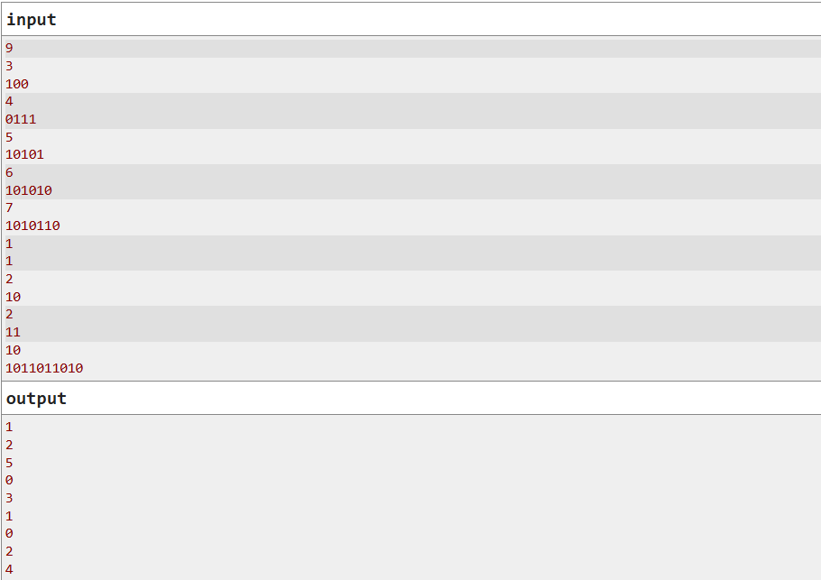

# **PREPARE AND APPEND**

Timur initially had a binary string $s$ (possibly of length 0). He performed the following operation several (possibly zero) times:

- Add 0 to one end of the string and 1 to the other end of the string. For example, starting from the string 1011, you can obtain either 010111 or 110110.

You are given Timur's final string. What is the length of the shortest possible string he could have started with?

A binary string is a string (possibly the empty string) whose characters are either 0 or 1.

### **INPUT**

The first line of the input contains an integer $t (1\leq t\leq 100)$ - the number of test cases

The first line of each test case contains an integer $n (1\leq n\leq 2000)$ - the length of Timur's final string.

The second line of each test case contains a string $s$ of length $n$ consisting of characters 0 or 1, denoting the final string.

### **OUTPUT**

For each test case, output a single nonnegative integer — the shortest possible length of Timur's original string. Note that Timur's original string could have been empty, in which case you should output 0.

### **Example:**



### **Note**

In the first test case, the shortest possible string Timur started with is 0, and he performed the following operation: 0 → 100.

In the second test case, the shortest possible string Timur started with is 11, and he performed the following operation: 11 → 0111.

In the third test case, the shortest possible string Timur started with is 10101, and he didn't perform any operations.

In the fourth test case, the shortest possible string Timur started with is the empty string (which we denote by ε), and he performed the following operations: ε → 10 → 0101 → 101010.

In the fifth test case, the shortest possible string Timur started with is 101, and he performed the following operations: 101 → 01011 → 1010110.

### **Solutions**

Full code [here](/TWO%20POINTERS/prepare_and_append.cpp)

```cpp
#include <bits/stdc++.h>
using namespace std;

int main(){
    freopen("input.txt", "r", stdin); freopen("output.txt", "w", stdout);
    ios::sync_with_stdio(false); cin.tie(nullptr);
    int t; cin >> t;
    while (t--){
        int n; cin >> n;
        string s; cin >> s;
        int i = 0;
        while (s[i] != s[s.length() - i - 1] && i < s.length() / 2)
            i++;
        cout << s.length() - (2 * i) << "\n";
    }
    return 0;
}
```