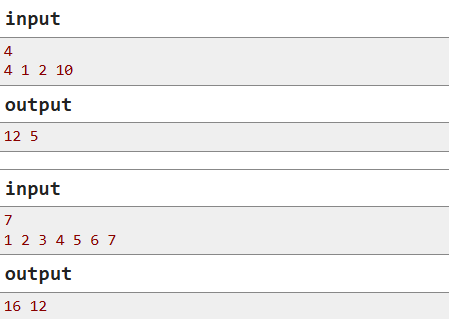

# **SEREJA AND DIMA**

Sereja and Dima play a game. The rules of the game are very simple. The players have $n$ cards in a row. Each card contains a number, all numbers on the cards are distinct. The players take turns, Sereja moves first. During his turn a player can take one card: either the leftmost card in a row, or the rightmost one. The game ends when there is no more cards. The player who has the maximum sum of numbers on his cards by the end of the game, wins.

Sereja and Dima are being greedy. Each of them chooses the card with the larger number during his move.

Inna is a friend of Sereja and Dima. She knows which strategy the guys are using, so she wants to determine the final score, given the initial state of the game. Help her.

### **Input**
The first line contains integer $n (1 ≤ n ≤ 1000)$ — the number of cards on the table. The second line contains space-separated numbers on the cards from left to right. The numbers on the cards are distinct integers from 1 to 1000.

### **Output**

On a single line, print two integers. The first number is the number of Sereja's points at the end of the game, the second number is the number of Dima's points at the end of the game.

### **Example**

### **Note:**

In the first sample Sereja will take cards with numbers 10 and 2, so Sereja's sum is 12. Dima will take cards with numbers 4 and 1, so Dima's sum is 5.

## **IDEA**

Ta thấy rằng bài này sử dụng hai con trỏ là tối ưu nhất. 

Đặt $l = 0, r = n - 1, d = 0, s = 0$ (trong đó $d$ là số điểm của Dima, $s$ là số điểm của Sereja)

Ta sẽ cũng đặt thêm một biến $turn$ để dễ dàng check xem  

## **SOLUTIONS**

Read more [here](/TWO%20POINTERS/sereja_and_dima.cpp)