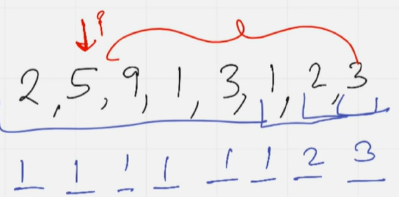
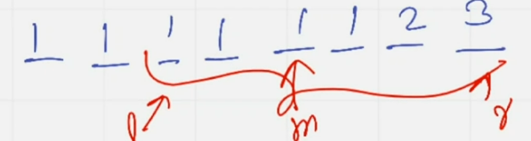

# FARTHEST ELEMENT

Given an array $arr[]$ of size $n$. For every element in the array, the task is to find the index of the farthest element in the array to the right which is smaller than the current element. If no such number exists then print $-1$.

**Note:** 0 based indexing. 

**Example**

```
n = 5
arr[] = [3, 1, 5, 2, 4]
Output: [3, -1, 4, -1, -1]
```

## ***BRUTE FORCE APPROACH***

A brute force approach to this problem can be, keep a variable $idx = -1$ from beginning and for each element start traversing the same array from the backward up to $(i+1)^{th}$ index. And, if at any index $j$ find smaller element from the current element,  i.e. $(a[i] > a[j])$ break from the loop.

Time complexity: $O(N^2)$

## ***EFFICIENT SOLUTION***

Take $arr[] = [3, 1, 5, 2, 4]$. We can use the suffix array.

- Let $suffix\_min[]$ be the array where $suffix\_min[i]$ stores the minimum element from the subarray $arr[i\ldots n - 1]$. Based on the example, $suffix\_min[] = [1, 1, 2, 2, 4]$. 

- Note that $suffix\_min[]$ is always increasing. Thus, binary search would be used. 

- For example:



- To find the farthest element of index 1, we will iterate through this red subarray. 



- The mid element here is smaller than 5, so we will store it. Then, $l = m + 1$ and have a new $m$. Now, $arr[m] < arr[i]$ thus we store $m = 6$. Then, $l = m + 1$ and reach $r$. Then, we found out that $arr[m] < arr[i]$ thus we store $m = 7$ as final result.

## ***IMPLEMENTATION***

View [here](/binary_search/farthest_element.cpp)