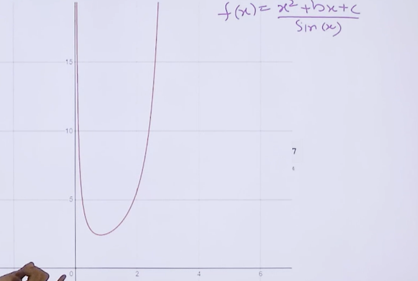

# **PROBLEM 3**

Find the minimum value of the function: 

$$
f(x) = \frac{x^2+bx+c}{\sin{x}} \space \left(x\in\left(0, \frac{n}{2}\right)\right)
$$

given that

$$
0\leq b, c\leq 10
$$

- At $x = 0, f(x) = +\infty$

- At $x = \pi / 2$