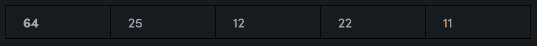
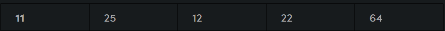
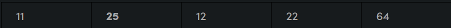
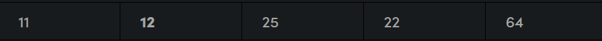
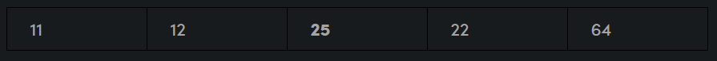
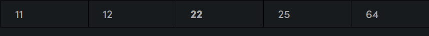
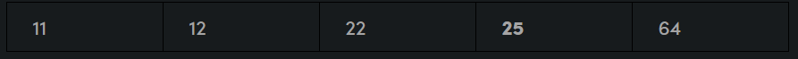
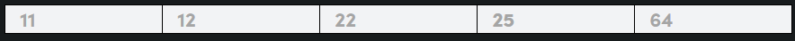

# **SELECTION SORT**

## ***What is selection sort?***

The selection sort algorithm sorts an array by **repeatedly finding the minimum element** (considering ascending order) from unsorted part and putting it at the beginning. The algorithm maintains two subarrays in a given array.

* The subarray which is already sorted. 

* Remaining subarray which is unsorted.

In every iteration of selection sort, the minimum element (considering ascending order) from the unsorted subarray is picked and moved to the sorted subarray.

## ***How it works***

Lets consider the following array as an example: arr[] = {64, 25, 12, 22, 11}

> ### **First pass:**
> - For the first position in the sorted array, the whole array is traversed from index 0 to 4 sequentially. The first position where 64 is stored presently, after traversing whole array it is clear that 11 is the lowest value.

> - Thus, replace 64 with 11. After one iteration 11, which happens to be the least value in the array, tends to appear in the first position of the sorted list.

> ### **Second pass**
> - For the second position, where 25 is present, again traverse the rest of the array in a sequential manner.

> - After traversing, we found that 12 is the second lowest value in the array and it should appear at the second place in the array, thus swap these values.

> ### **Third pass**
> - Now, for third place, where 25 is present again traverse the rest of the array and find the third least value present in the array.

> - While traversing, 22 came out to be the third least value and it should appear at the third place in the array, thus swap 22 with element present at third position.

> ### **Fourth pass**
> - Similarly, for fourth position traverse the rest of the array and find the fourth least element in the array 
> - As 25 is the 4th lowest value hence, it will place at the fourth position.

> ### **Fifth pass**
> - At last the largest value present in the array automatically get placed at the last position in the array
> - The resulted array is the sorted array.


## **How do we approach?**

> * Initialize minimum value(min_idx) to location 0
> * Traverse the array to find the minimum element in the array
> * While traversing if any element smaller than min_idx is found then swap both the values.
> * Then, increment min_idx to point to next element
> * Repeat until array is sorted

## ***Naive implementation***

```cpp
void selection(int arr[], int n){
    int temp[n];
    for (int i = 0; i < n; i++){
        int min_index = 0;
        for (int j = 1; j < n; j++){
            if (arr[j] < arr[min_index])
                min_index = j;
        }
        temp[i] = arr[min_index];
        arr[min_index] = INF;
    }
    for (int i = 0; i < n; i++)
        arr[i] = temp[i];
}
```

## ***Optimal solution***

```cpp
void selection_sort(int arr[], int n){
    for (int i = 0; i < n; i++){
        min_index = i;
        for (int j = i + 1; j < n; j++){
            if (arr[j] < arr[min_index])
                min_index = j;
        }
        swap(arr[min_index], arr[i]);
    }
}
```
Time complexity: $O(n^2)$